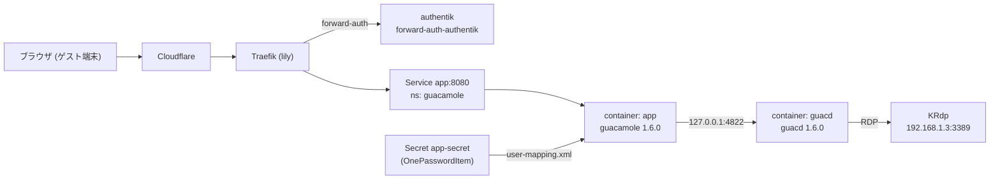

# Guacamole によるブラウザ経由リモートデスクトップ 実装プラン

> **For agentic workers:** REQUIRED SUB-SKILL: Use superpowers:subagent-driven-development (recommended) or superpowers:executing-plans to implement this plan task-by-task. Steps use checkbox (`- [ ]`) syntax for tracking.

**Goal:** ゲスト端末にクライアントを入れずに、ブラウザだけで Momiji (Plasma Wayland) のデスクトップを操作できるようにする。

**Architecture:** lily の `guacamole` namespace に Apache Guacamole を 1 Pod (guacamole + guacd の 2 コンテナ) で置く。Traefik の `forward-auth-authentik` を前段に立て、guacd から Momiji の KRdp (192.168.1.3:3389) に RDP で中継する。Guacamole 自身の認証は `user-mapping.xml` のファイルベースとし、ファイルは丸ごと 1Password に持たせる。

**Tech Stack:** Kubernetes (lily), Argo CD, Kustomize, Traefik IngressRoute, authentik forward-auth, external-dns (DNSEndpoint), 1Password Connect (OnePasswordItem), Apache Guacamole 1.6.0, KRdp (Plasma 6.7)

設計は `docs/superpowers/specs/2026-08-28_guacamole-remote-desktop.md` を参照する。

## Global Constraints

- **このリポジトリは公開されている。** パスワード、パスワードハッシュ、RDP の資格情報を、マニフェスト・コミットメッセージ・PR 本文・本ドキュメントのいずれにも書かない
- イメージは digest 固定で書く (Renovate が認識できる `repo:tag@sha256:...` 形式)
  - `guacamole/guacamole:1.6.0@sha256:f344085e618bb05e22b964b0208dbd06d3468275bac70206f93805245e067b40`
  - `guacamole/guacd:1.6.0@sha256:8974eaa9ba32f713daf311e7cc8cd7e4cdfba1edea39eed75524e78ef4b08f4f`
- 実行ユーザーは固定。guacamole は UID/GID 1001、guacd は UID/GID 1000
- 両コンテナとも `readOnlyRootFilesystem: true` を維持し、`/tmp` に emptyDir を与える
- `pnpm eslint` の `yml/sort-keys` に従う。マッピングのキー順は `apiVersion` → `kind` → `metadata` → `spec` の順、それ以外は既定で昇順。`kustomization.yaml` の `resources` 配列は昇順に並べる
- 公開ホストは `remote.starry.blue` の 1 系統のみ。`remote.gateway.starry.blue` は作らない
- 対象クラスタは lily のみ。bbc には載せない
- ブランチは `feat/guacamole`。コミットメッセージは Conventional Commits 形式、日本語、`Co-Authored-By: Claude Fable 6 <noreply@anthropic.com>` を付ける

---

## Task 1: Momiji に KRdp を導入して lily から到達可能にする

Guacamole 側を作っても、KRdp が LAN に listen していなければ疎通確認ができない。先にホスト側を通す。

**Files:**
- なし (Momiji ホストの操作のみ)

**Interfaces:**
- Produces: `192.168.1.3:3389` で待ち受ける RDP サーバー。Task 2 の `user-mapping.xml` と Task 5 の疎通確認がこれに依存する

- [ ] **Step 1: krdp を導入する**

```bash
sudo pacman -S --needed krdp freerdp
```

`freerdp` は Task 1 Step 6 の疎通確認で `xfreerdp3` を使うために入れる。

- [ ] **Step 2: 利用者にリモートデスクトップの有効化を依頼する**

次を利用者に依頼し、完了の返答を待つ。**資格情報は実装側で入力も保持もしない。**

> システム設定 →「リモートデスクトップ」を開き、
> 1. 「RDP でこのデスクトップへの接続を有効にする」をオンにする
> 2. ユーザー名とパスワードを 1 組登録する
> 3. アドレスとポートが `0.0.0.0:3389` (または LAN アドレス:3389) になっていることを確認する
>
> ここで決めたユーザー名とパスワードは Task 2 で使う。

- [ ] **Step 3: listen 状態を確認する**

Run: `ss -tlnp | grep 3389`

Expected: `127.0.0.1:3389` ではなく `0.0.0.0:3389` または `192.168.1.3:3389` で LISTEN していること。

`127.0.0.1` に閉じていた場合は、システム設定のリモートデスクトップでアドレス設定を見直してもらう。ここが `127.0.0.1` のままだと lily の Pod からは絶対に到達できない。

- [ ] **Step 4: ufw の現状を確認する**

Run: `sudo ufw status verbose`

Expected: ufw が `active` であること。3389 に関する既存ルールがあるかを確認する。

- [ ] **Step 5: 3389 を lily からのみ許可する**

```bash
sudo ufw allow from 192.168.1.2 to any port 3389 proto tcp comment 'KRdp from lily (guacd)'
```

lily は単一ノードであり、Cilium が Pod の egress をノード IP (192.168.1.2) に masquerade する前提に立つ。この前提が誤っていれば Step 7 で到達不能として現れる。

Run: `sudo ufw status numbered | grep 3389`

Expected: `192.168.1.2` からの 3389/tcp ALLOW が 1 行出ること。

- [ ] **Step 6: ローカルから RDP が応答することを確認する**

```bash
timeout 10 xfreerdp3 /v:127.0.0.1:3389 /cert:ignore /u:dummy /p:dummy 2>&1 | head -20
```

Expected: 認証失敗のメッセージが出ること。認証が通る必要はない。「接続拒否」「タイムアウト」ではなく、RDP の折衝が始まっていることが確認できればよい。

- [ ] **Step 7: lily の Pod から 3389 に到達できることを確認する**

```bash
kubectl run rdp-probe --rm -i --restart=Never --image=busybox:1.37 -- \
  sh -c 'nc -z -w 5 192.168.1.3 3389 && echo REACHABLE || echo UNREACHABLE'
```

Expected: `REACHABLE`

`UNREACHABLE` の場合、送信元が 192.168.1.2 でない可能性がある。Momiji で `sudo journalctl -k -n 50 | grep UFW` を見て実際の送信元アドレスを確認し、ufw のルールをその送信元に合わせて修正する。この Pod は Argo CD の管理外なので selfHeal の影響を受けない。

- [ ] **Step 8: 結果を記録する**

Step 3、Step 5、Step 7 の出力を控える。PR の証跡として使う。

---

## Task 2: user-mapping.xml を 1Password に登録する

マニフェストの `secret.yaml` には 1Password の item パスが要る。item がないとマニフェストが書けないので、Task 3 より先に行う。

**Files:**
- なし (1Password 側の操作のみ)

**Interfaces:**
- Consumes: Task 1 で登録した KRdp のユーザー名とパスワード
- Produces: `vaults/<vault-id>/items/<item-id>` 形式の item パス。フィールド名は `user-mapping.xml`。Task 3 の `resources/secret.yaml` がこれを参照する

- [ ] **Step 1: Guacamole ログインパスワードのハッシュ生成手順を利用者に渡す**

次を利用者に伝える。**生成したパスワードとハッシュを実装側は受け取らない。**

```bash
printf '%s' 'ここに Guacamole のログインパスワード' | sha256sum | cut -d' ' -f1
```

出力は 64 桁の 16 進文字列になる。Guacamole 1.6.0 は格納側を大文字化してから比較するため、`sha256sum` の小文字出力をそのまま使ってよい。

- [ ] **Step 2: user-mapping.xml のテンプレートを利用者に渡す**

次のテンプレートを渡し、`<>` で囲んだ 4 箇所を埋めてもらう。

```xml
<user-mapping>
    <authorize username="<Guacamole のログインユーザー名>"
               password="<Step 1 で生成した 64 桁のハッシュ>"
               encoding="sha256">
        <connection name="Momiji">
            <protocol>rdp</protocol>
            <param name="hostname">192.168.1.3</param>
            <param name="port">3389</param>
            <param name="username"><KRdp のユーザー名></param>
            <param name="password"><KRdp のパスワード></param>
            <param name="security">any</param>
            <param name="ignore-cert">true</param>
            <param name="resize-method">display-update</param>
        </connection>
    </authorize>
</user-mapping>
```

`security` と `ignore-cert` は KRdp の自己署名証明書に対する出発点である。Task 5 の初回接続の結果を見て絞る。

- [ ] **Step 3: 1Password に item を作成してもらう**

次を利用者に依頼する。

> 1Password に新しい item を作り、フィールドを 1 つ追加する。
> - フィールド名 (ラベル): `user-mapping.xml`
> - 値: Step 2 で埋めた XML 全体
>
> item の URL または `vaults/<vault-id>/items/<item-id>` 形式のパスを教えてほしい。

フィールド名がそのまま Secret のキーになるため、`user-mapping.xml` から一字でも変えてはならない。

- [ ] **Step 4: item パスを受け取る**

受け取った `vaults/<vault-id>/items/<item-id>` を控える。Task 3 Step 6 でそのまま書く。

---

## Task 3: マニフェストを作成する

**Files:**
- Create: `k8s/apps/guacamole/kustomization.yaml`
- Create: `k8s/apps/guacamole/resources/namespace.yaml`
- Create: `k8s/apps/guacamole/resources/deployment.yaml`
- Create: `k8s/apps/guacamole/resources/service.yaml`
- Create: `k8s/apps/guacamole/resources/ingress.yaml`
- Create: `k8s/apps/guacamole/resources/dns.yaml`
- Create: `k8s/apps/guacamole/resources/secret.yaml`
- Modify: `k8s/system/argo-cd/resources/application/lily.yaml:174` の直後

**Interfaces:**
- Consumes: Task 2 で得た 1Password item パス
- Produces: Service `app` (ns `guacamole`, port 8080)、ホスト `remote.starry.blue`

- [ ] **Step 1: ブランチを確認する**

Run: `git branch --show-current`
Expected: `feat/guacamole`

異なる場合は `git switch feat/guacamole` する。

- [ ] **Step 2: namespace.yaml を作る**

`k8s/apps/guacamole/resources/namespace.yaml`:

```yaml
apiVersion: v1
kind: Namespace
metadata:
  name: guacamole
```

- [ ] **Step 3: deployment.yaml を作る**

`k8s/apps/guacamole/resources/deployment.yaml`:

```yaml
apiVersion: apps/v1
kind: Deployment
metadata:
  name: deployment

spec:
  replicas: 1
  selector:
    matchLabels:
      app: default
  template:
    metadata:
      labels:
        app: default
    spec:
      containers:
        - name: app
          image: guacamole/guacamole:1.6.0@sha256:f344085e618bb05e22b964b0208dbd06d3468275bac70206f93805245e067b40
          env:
            - name: TZ
              value: Asia/Tokyo
            # guacd は同一 Pod の 2 つ目のコンテナとして動かす
            - name: GUACD_HOSTNAME
              value: 127.0.0.1
            - name: GUACD_PORT
              value: "4822"
            # 既定では /guacamole に配信されるため、ROOT を指定して / に置く
            - name: WEBAPP_CONTEXT
              value: ROOT
          ports:
            - containerPort: 8080
          volumeMounts:
            - name: config
              mountPath: /etc/guacamole/user-mapping.xml
              readOnly: true
              subPath: user-mapping.xml
            # entrypoint が GUACAMOLE_HOME と CATALINA_BASE を /tmp 配下に mktemp するため、
            # readOnlyRootFilesystem のままでは書き込み先が要る
            - name: tmp
              mountPath: /tmp
          livenessProbe:
            httpGet:
              path: /
              port: 8080
            periodSeconds: 30
            timeoutSeconds: 5
          readinessProbe:
            httpGet:
              path: /
              port: 8080
            periodSeconds: 10
            timeoutSeconds: 5
          securityContext:
            allowPrivilegeEscalation: false
            capabilities:
              drop:
                - ALL
            readOnlyRootFilesystem: true
            runAsGroup: 1001
            runAsUser: 1001
          startupProbe:
            # Tomcat の起動と webapp の展開に時間がかかる
            failureThreshold: 30
            httpGet:
              path: /
              port: 8080
            periodSeconds: 5
            timeoutSeconds: 5
        - name: guacd
          image: guacamole/guacd:1.6.0@sha256:8974eaa9ba32f713daf311e7cc8cd7e4cdfba1edea39eed75524e78ef4b08f4f
          env:
            - name: TZ
              value: Asia/Tokyo
          ports:
            - containerPort: 4822
          volumeMounts:
            - name: guacd-tmp
              mountPath: /tmp
          livenessProbe:
            tcpSocket:
              port: 4822
            periodSeconds: 30
            timeoutSeconds: 5
          readinessProbe:
            tcpSocket:
              port: 4822
            periodSeconds: 10
            timeoutSeconds: 5
          securityContext:
            allowPrivilegeEscalation: false
            capabilities:
              drop:
                - ALL
            readOnlyRootFilesystem: true
            runAsGroup: 1000
            runAsUser: 1000
      volumes:
        - name: config
          secret:
            secretName: app-secret
        - name: tmp
          emptyDir: {}
        - name: guacd-tmp
          emptyDir: {}
      restartPolicy: Always
      securityContext:
        seccompProfile:
          type: RuntimeDefault
```

- [ ] **Step 4: service.yaml を作る**

`k8s/apps/guacamole/resources/service.yaml`:

```yaml
apiVersion: v1
kind: Service
metadata:
  name: app

spec:
  selector:
    app: default
  ports:
    - name: "8080"
      port: 8080
      targetPort: 8080
      protocol: TCP
```

guacd の 4822 は Service に出さない。同一 Pod 内からしか使わない。

- [ ] **Step 5: ingress.yaml を作る**

`k8s/apps/guacamole/resources/ingress.yaml`:

```yaml
apiVersion: traefik.io/v1alpha1
kind: IngressRoute
metadata:
  name: route

spec:
  routes:
    - kind: Rule
      match: Host(`remote.starry.blue`)
      priority: 10
      services:
        - name: app
          port: 8080
      middlewares:
        - name: forward-auth-authentik
          namespace: authentik

    - kind: Rule
      match: Host(`remote.starry.blue`) && PathPrefix(`/outpost.goauthentik.io/`)
      priority: 15
      services:
        - name: authentik-server
          namespace: authentik
          port: http
```

- [ ] **Step 6: secret.yaml を作る**

`k8s/apps/guacamole/resources/secret.yaml`。`itemPath` は Task 2 Step 4 で受け取った値をそのまま書く。

```yaml
apiVersion: onepassword.com/v1
kind: OnePasswordItem
metadata:
  name: app-secret

spec:
  itemPath: vaults/<Task 2 で受け取った vault-id>/items/<Task 2 で受け取った item-id>
```

- [ ] **Step 7: dns.yaml を作る**

`k8s/apps/guacamole/resources/dns.yaml`:

```yaml
apiVersion: externaldns.k8s.io/v1alpha1
kind: DNSEndpoint
metadata:
  name: dns

spec:
  endpoints:
    - dnsName: remote.starry.blue
      providerSpecific:
        - name: external-dns.alpha.kubernetes.io/cloudflare-proxied
          value: "true"
      recordTTL: 1 # Auto
      recordType: CNAME
      targets:
        - gateway.starry.blue

---
apiVersion: mackerel.starry.blue/v1alpha1
kind: ExternalMonitor
metadata:
  name: https

spec:
  certificationExpirationCritical: 7
  certificationExpirationWarning: 30
  expectedStatusCode: 200
  method: GET
  responseTimeCritical: 10000
  responseTimeDuration: 5
  responseTimeWarning: 5000
  service: Production
  url: https://remote.starry.blue/
```

Guacamole に `/health` に相当する端点はないため `/` を見る。forward-auth を通す他の app と同じ扱いである。

- [ ] **Step 8: kustomization.yaml を作る**

`k8s/apps/guacamole/kustomization.yaml`。`resources` は昇順に並べる (`yml/sort-sequence-values`)。

```yaml
apiVersion: kustomize.config.k8s.io/v1beta1
kind: Kustomization
namespace: guacamole

resources:
  - ./resources/deployment.yaml
  - ./resources/dns.yaml
  - ./resources/ingress.yaml
  - ./resources/namespace.yaml
  - ./resources/secret.yaml
  - ./resources/service.yaml
```

- [ ] **Step 9: ApplicationSet に登録する**

`k8s/system/argo-cd/resources/application/lily.yaml` の `home-assistant` の項目 (174 行目) の直後、`# cron` コメントの前に追加する。

```yaml
          - name: guacamole
            namespace: guacamole
            path: k8s/apps/guacamole
            project: apps
```

**この登録を忘れると Argo CD は何もデプロイしない。**

- [ ] **Step 10: レンダリングを確認する**

Run: `kubectl kustomize k8s/apps/guacamole`

Expected: 7 つのリソース (Namespace, Deployment, Service, IngressRoute, DNSEndpoint, ExternalMonitor, OnePasswordItem) が `namespace: guacamole` 付きで出力されること。エラーが出ないこと。

- [ ] **Step 11: lint を通す**

Run: `pnpm eslint`

Expected: エラーなし。

`yml/sort-keys` に落ちた場合は指摘されたキー順を直す。**設定を変更したり抑制コメントを入れたりしない。** どうしても解消できない場合は利用者に方針を確認する。

- [ ] **Step 12: kube-linter を通す**

Run: `kube-linter lint --config .kube-linter.yaml k8s/apps/guacamole`

Expected: `No lint errors found!`

- [ ] **Step 13: server-side dry-run で API に受理させる**

namespaced リソースの server-side dry-run は namespace が実在しないと `namespaces "guacamole" not found` で落ちる。先に Namespace だけ実体を作る。

```bash
kubectl create namespace guacamole
kubectl kustomize k8s/apps/guacamole | kubectl apply --server-side --dry-run=server -f -
```

Expected: 全リソースが `serverside-applied (server dry run)` になること。

`OnePasswordItem` と `ExternalMonitor` と `IngressRoute` は CRD である。CRD が未登録ならここで落ちるので、実際に当てる前に分かる。

作った Namespace はそのまま残してよい。マージ後に Argo CD が同名の Namespace を管理下に取り込む。中身は空なので、マージまでの間に何かが動くことはない。

- [ ] **Step 14: コミットする**

```bash
git add k8s/apps/guacamole k8s/system/argo-cd/resources/application/lily.yaml
git commit -m "$(cat <<'MSG'
feat(guacamole): ブラウザから Momiji のデスクトップを操作できるようにする

Wayland セッションはコンポジタ側のリモートデスクトップ機構でしか配信できず、
ゲスト端末にはクライアントを入れたくない。
guacamole と guacd を 1 Pod に置き、HTML5 クライアントとして
Momiji の KRdp に中継する。

Guacamole 自身の認証は user-mapping.xml のファイルベースとし、
ファイルは丸ごと 1Password に持たせる。
前段には forward-auth-authentik を立てる。

Co-Authored-By: Claude Fable 6 <noreply@anthropic.com>
MSG
)"
```

---

## Task 4: PR を作成する

**Files:**
- なし (GitHub 上の操作)

**Interfaces:**
- Consumes: Task 1 と Task 3 の実行結果
- Produces: master へのマージ

- [ ] **Step 1: push する**

```bash
git push -u origin feat/guacamole
```

- [ ] **Step 2: PR を作成する**

PR 本文に次を含める。**資格情報、ハッシュ、1Password の item パスは書かない。**

- 目的とゲスト端末にインストールを要求しないという要件
- Wayland のため x11vnc / xrdp が使えないこと
- authentik RAC が Enterprise ライセンスを要するため採らなかったこと
- Task 1 Step 3 / Step 5 / Step 7 の出力 (before / after の証跡)
- マージ時点で未検証の事項 (下記)
- リソースグラフ (Mermaid)

リソースグラフのセクション:

````markdown
## リソースグラフ


````

未検証事項として次を明記する。

> Argo CD の selfHeal によりマージ前に実クラスタへ当てた変更は巻き戻るため、
> 実画面での動作確認はマージ後に行う。
> 現時点で検証済みなのは、マニフェストのレンダリング、lint、server-side dry-run、
> および lily の Pod から Momiji の 3389 へ到達できることまでである。
> KRdp と Guacamole の RDP 折衝 (`security` の選択、キーボードレイアウト) は未検証である。

- [ ] **Step 3: 自分を Assign する**

```bash
gh pr edit --add-assignee @me
```

- [ ] **Step 4: マージ可否を確認する**

```bash
gh pr view --json mergeable,mergeStateStatus
```

Expected: `MERGEABLE`

コンフリクトしている場合は master を取り込んで解消する。

- [ ] **Step 5: 未検証事項があるため Draft のままにするか判断する**

実画面検証がマージ後にしかできない構造上、この PR は「マージしないと検証できない」。利用者にマージの可否を確認し、了承を得てからマージする。実装側で勝手にマージしない。

---

## Task 5: マージ後に実画面を検証する

**Files:**
- 必要に応じて Modify: 1Password の `user-mapping.xml` (接続パラメータの調整)

**Interfaces:**
- Consumes: master にマージされた Task 3 のマニフェスト

- [ ] **Step 1: Pod が Ready になることを確認する**

```bash
kubectl -n guacamole get pod -w
```

Expected: 2/2 Running になること。

`CreateContainerConfigError` なら Secret がまだ生成されていない。`kubectl -n guacamole get secret app-secret` と `kubectl -n guacamole get onepassworditem app-secret -o yaml` を見る。

- [ ] **Step 2: 起動ログを確認する**

```bash
kubectl -n guacamole logs deployment/deployment -c app --tail=50
```

Expected: Tomcat が起動し、`user-mapping.xml` の読み込みに関するエラーが出ていないこと。

XML のパースエラーが出た場合は 1Password 側の値を利用者に直してもらい、Pod を再起動する。`subPath` マウントは値の更新が反映されないため、Secret 更新後は必ず `kubectl -n guacamole rollout restart deployment/deployment` する。

- [ ] **Step 3: クラスタ内から HTTP 応答を確認する**

```bash
kubectl -n guacamole run http-probe --rm -i --restart=Never --image=curlimages/curl:8.11.1 -- \
  curl -sS -o /dev/null -w '%{http_code}\n' http://app.guacamole.svc.cluster.local:8080/
```

Expected: `200`

`404` の場合は `WEBAPP_CONTEXT: ROOT` が効いていない。`/guacamole/` で 200 が返るか確認する。

- [ ] **Step 4: ブラウザで実画面を確認する**

利用者のログイン済み Chrome で `https://remote.starry.blue/` を開く。authentik を通す必要があるため、この手順は実装側の headless ブラウザでは完結しない。

確認する項目:

1. authentik の認証を通ること
2. Guacamole のログイン画面が出て、Task 2 で決めた資格情報でログインできること
3. `Momiji` の接続をクリックしてデスクトップが表示されること
4. マウス操作が反映されること
5. キーボード入力が反映され、記号が意図どおりに入ること
6. ウィンドウサイズを変えたときに解像度が追随すること (`resize-method=display-update` の効果)

連続的な操作の検証になるため、画面録画を取る。

- [ ] **Step 5: 接続パラメータを絞る**

Step 4 の結果に応じて 1Password の `user-mapping.xml` を調整する。

| 症状 | 調整 |
| --- | --- |
| 接続できるが証明書警告で切れる | `security` を `tls` に固定する |
| 折衝に失敗して切れる | `security` を `nla` または `rdp` に変えて試す |
| 記号キーがずれる | `<param name="server-layout">ja-jp-qwerty</param>` を追加する |
| 解像度が追随しない | `resize-method` を `reconnect` に変える |

調整するたびに `kubectl -n guacamole rollout restart deployment/deployment` して Step 4 をやり直す。

- [ ] **Step 6: 確定した設定と証跡を報告する**

最終的な `security` の値、追加したパラメータ、録画を利用者に報告する。パラメータ名は報告してよいが、資格情報は報告しない。

- [ ] **Step 7: Mackerel の外形監視が正常になることを確認する**

Mackerel の Production サービスに `remote.starry.blue` の外形監視が登録され、OK になっていることを確認する。

---

## 実装後に残る既知の制約

これらは設計時に受容した。実装で解消しようとしない。

- Guacamole は RDP の H.264 (RemoteFX GFX) を使わず独自プロトコルで画像を送るため、動画再生やゲームには向かない
- KRdp はログイン済みセッションへの接続である。SDDM のログイン画面や、再起動後にセッションがない状態には接続できない
- authentik を通った後に Guacamole のログイン画面をもう 1 回通る。これは Service 直叩きに対する多層防御として意図的に残している
