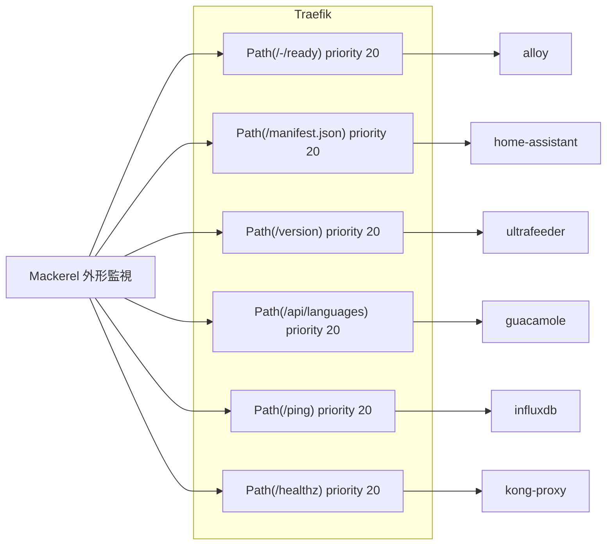
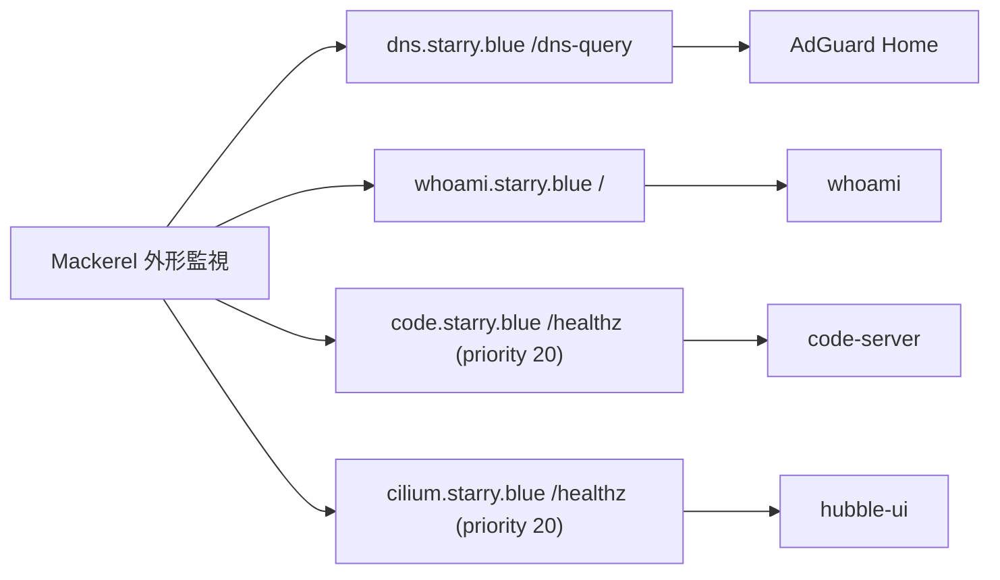

# 外形監視の網羅と 200 化 実装計画

> **For agentic workers:** REQUIRED SUB-SKILL: Use superpowers:subagent-driven-development (recommended) or superpowers:executing-plans to implement this plan task-by-task. Steps use checkbox (`- [ ]`) syntax for tracking.

**Goal:** 稼働中の IngressRoute のホストに外形監視を行き渡らせ、全ての `ExternalMonitor` が 302 ではなく 200 系のステータスコードを期待する状態にする。

**Architecture:** authentik の forward-auth を迂回させるヘルスチェック用のパスを、authentik コンソールの `skip_path_regex` ではなく各アプリの `IngressRoute` に `Path()` 完全一致の例外ルートとして追加する。その上で `ExternalMonitor` の URL をそのパスに向ける。設定がマニフェストに現れるため、レビューと差分追跡の対象になる。

**Tech Stack:** Kubernetes / Kustomize / Traefik v3 IngressRoute CRD / mackerel-operator (`mackerel.starry.blue/v1alpha1` の `ExternalMonitor`) / ArgoCD

設計の根拠は [spec](../specs/2026-09-13_external-monitor-coverage.md) を参照すること。

## Global Constraints

- 本リポジトリは **公開リポジトリ** である。コミットメッセージ、PR、コメントに非公開情報を含めない。
- コメントとコミットメッセージ、PR は日本語で書く。ログとエラーメッセージは英語。
- コミットメッセージは Conventional Commits 形式。`Co-Authored-By: Claude Mythos 5.1 <noreply@anthropic.com>` を末尾に付ける。
- 例外ルートの `priority` は **20**。`match` は `PathPrefix()` ではなく **`Path()` の完全一致** を使う。例外ルートに `forward-auth-authentik` middleware を **付けない**。
- 例外ルートに選ぶパスは、Cloudflare の既定キャッシュ対象拡張子 (`.js` / `.css` / `.ico` / `.png` など) を持たないこと。全ホストが `cloudflare-proxied: true` のため、キャッシュされるとオリジン停止時にも 200 が返る。
- `ExternalMonitor` のフィールド順は既存ファイルに揃える (`certificationExpirationCritical`, `certificationExpirationWarning`, `expectedStatusCode`, `method`, `responseTimeCritical`, `responseTimeDuration`, `responseTimeWarning`, `service`, `url`)。
- 全ての `ExternalMonitor` は `service: Production`、`certificationExpiration{Critical,Warning}: 7 / 30`、`responseTime{Critical,Warning}: 10000 / 5000`、`responseTimeDuration: 5`、`method: GET` を共通で持つ。
- ArgoCD の selfHeal によりマージ前の `kubectl apply` は巻き戻る。マージ前の検証は `--dry-run=server` までとする。
- PR は 3 本の Stacked PR として積む。各 PR の本文に「リソースグラフ」セクションを設け、変更したリソースの関係を Mermaid のフローチャートで示す。PR 作成後にユーザーを Assign する。

## File Structure

| ファイル | 変更内容 |
| --- | --- |
| `k8s/apps/grafana-alloy/resources/ingress.yaml` | 例外ルート追加 |
| `k8s/apps/grafana-alloy/resources/dns.yaml` | `ExternalMonitor` 新規追加 |
| `k8s/apps/home-assistant/resources/ingress.yaml` | 例外ルート追加 |
| `k8s/apps/home-assistant/resources/dns.yaml` | `ExternalMonitor` 新規追加 |
| `k8s/apps/sdr-enthusiasts/resources/ingress.yaml` | 例外ルート追加 + catch-all の `priority` 明示 |
| `k8s/apps/sdr-enthusiasts/resources/dns.yaml` | `ExternalMonitor` 新規追加 |
| `k8s/apps/guacamole/resources/ingress.yaml` | 例外ルート追加 |
| `k8s/apps/guacamole/resources/dns.yaml` | 既存 `ExternalMonitor` の URL と期待値を変更 |
| `k8s/apps/influxdb/resources/ingress.yaml` | 例外ルート追加 |
| `k8s/apps/influxdb/resources/dns.yaml` | 既存 `ExternalMonitor` の URL と期待値を変更 |
| `k8s/apps/kubernetes-dashboard/resources/ingress.yaml` | 例外ルート追加 |
| `k8s/apps/kubernetes-dashboard/resources/dns.yaml` | 既存 `ExternalMonitor` の URL と期待値を変更 |
| `k8s/system/traefik/lily/resources/routes/dashboard.yaml` | `/ping` ルート追加 + 既存 `ExternalMonitor` の変更 |
| `k8s/apps/adguard-home/resources/dns.yaml` | `ExternalMonitor` 新規追加 |
| `k8s/system/traefik/lily/resources/whoami/resources/dns.yaml` | `ExternalMonitor` 新規追加 |
| `k8s/apps/code-server/resources/ingress.yaml` | 例外ルート追加 |
| `k8s/apps/code-server/resources/dns.yaml` | `ExternalMonitor` 新規追加 |
| `k8s/system/cilium/lily/resources/ingress.yaml` | 例外ルート追加 |
| `k8s/system/cilium/lily/resources/dns.yaml` | `ExternalMonitor` 新規追加 |

## 共通の検証コマンド

各タスクで使う。

```bash
# Kustomize の全ビルドが通ることを確認する
go run ./cmd/build-manifests
```

```bash
# kube-linter による静的検査
mise exec -- kube-linter lint --config .kube-linter.yaml ./k8s
```

```bash
# 単一ディレクトリを API サーバに対して dry-run する
mise exec -- kustomize build --enable-helm <ディレクトリ> | kubectl apply --dry-run=server -f -
```

---

## PR 1: 例外ルートの追加と監視の 200 化

ブランチ `feat/external-monitor-coverage` (spec と本計画のコミットを含む) で作業する。

### Task 1: grafana-alloy

**Files:**
- Modify: `k8s/apps/grafana-alloy/resources/ingress.yaml`
- Modify: `k8s/apps/grafana-alloy/resources/dns.yaml`

**Interfaces:**
- Produces: `https://grafana-alloy.starry.blue/-/ready` が認証なしで 200 を返す。

- [ ] **Step 1: 変更前の応答を記録する**

```bash
curl -sS -o /dev/null -w '%{http_code}\n' https://grafana-alloy.starry.blue/-/ready
```

Expected: `302` (forward-auth によるリダイレクト)

- [ ] **Step 2: 例外ルートを追加する**

`k8s/apps/grafana-alloy/resources/ingress.yaml` の `spec.routes` の末尾に追加する。

```yaml
    # 外形監視のため Alloy の readiness 端点のみ認証を迂回させる。
    # authentik の Unauthenticated Paths ではなくここで表現し、設定を可視化する。
    - kind: Rule
      match: Host(`grafana-alloy.starry.blue`) && Path(`/-/ready`)
      priority: 20
      services:
        - name: alloy
          port: http-metrics
```

- [ ] **Step 3: ExternalMonitor を追加する**

`k8s/apps/grafana-alloy/resources/dns.yaml` の末尾に追加する。

```yaml

---
apiVersion: mackerel.starry.blue/v1alpha1
kind: ExternalMonitor
metadata:
  name: https

spec:
  certificationExpirationCritical: 7
  certificationExpirationWarning: 30
  expectedStatusCode: 200
  method: GET
  responseTimeCritical: 10000
  responseTimeDuration: 5
  responseTimeWarning: 5000
  service: Production
  url: https://grafana-alloy.starry.blue/-/ready
```

- [ ] **Step 4: ビルドと dry-run**

```bash
go run ./cmd/build-manifests
```

Expected: 失敗ディレクトリが 0 件で終了する。

```bash
mise exec -- kustomize build --enable-helm k8s/apps/grafana-alloy | kubectl apply --dry-run=server -f -
```

Expected: 全リソースに `(server dry run)` が付き、`configured` または `unchanged` と表示される。エラーが出ないこと。

- [ ] **Step 5: コミット**

```bash
git add k8s/apps/grafana-alloy/resources/ingress.yaml k8s/apps/grafana-alloy/resources/dns.yaml
git commit -m "feat(grafana-alloy): readiness 端点の外形監視を追加

forward-auth を迂回する例外ルートを IngressRoute 側に追加し、
/-/ready に対する外形監視を作成した。

Co-Authored-By: Claude Mythos 5.1 <noreply@anthropic.com>"
```

### Task 2: home-assistant

**Files:**
- Modify: `k8s/apps/home-assistant/resources/ingress.yaml`
- Modify: `k8s/apps/home-assistant/resources/dns.yaml`

**Interfaces:**
- Produces: `https://home.starry.blue/manifest.json` が認証なしで 200 を返す。

- [ ] **Step 1: 変更前の応答を記録する**

```bash
curl -sS -o /dev/null -w '%{http_code}\n' https://home.starry.blue/manifest.json
```

Expected: `302`

- [ ] **Step 2: 例外ルートを追加する**

`k8s/apps/home-assistant/resources/ingress.yaml` の `spec.routes` の末尾に追加する。

```yaml
    # 外形監視のため manifest.json のみ認証を迂回させる。
    # 認証機構の構成を返す /auth/providers は開けない。
    - kind: Rule
      match: Host(`home.starry.blue`) && Path(`/manifest.json`)
      priority: 20
      services:
        - name: home-assistant
          port: http
```

- [ ] **Step 3: ExternalMonitor を追加する**

`k8s/apps/home-assistant/resources/dns.yaml` の末尾に追加する。

```yaml

---
apiVersion: mackerel.starry.blue/v1alpha1
kind: ExternalMonitor
metadata:
  name: https

spec:
  certificationExpirationCritical: 7
  certificationExpirationWarning: 30
  expectedStatusCode: 200
  method: GET
  responseTimeCritical: 10000
  responseTimeDuration: 5
  responseTimeWarning: 5000
  service: Production
  url: https://home.starry.blue/manifest.json
```

- [ ] **Step 4: ビルドと dry-run**

```bash
go run ./cmd/build-manifests
```

Expected: 失敗ディレクトリが 0 件。

```bash
mise exec -- kustomize build --enable-helm k8s/apps/home-assistant | kubectl apply --dry-run=server -f -
```

Expected: エラーなし。

- [ ] **Step 5: コミット**

```bash
git add k8s/apps/home-assistant/resources/ingress.yaml k8s/apps/home-assistant/resources/dns.yaml
git commit -m "feat(home-assistant): manifest.json の外形監視を追加

forward-auth を迂回する例外ルートを IngressRoute 側に追加し、
manifest.json に対する外形監視を作成した。

Co-Authored-By: Claude Mythos 5.1 <noreply@anthropic.com>"
```

### Task 3: sdr-enthusiasts

このタスクは例外ルートの追加に加え、既存の catch-all ルートに `priority` を明示する修正を含む。

Traefik v3 は `priority` を省略したルータの優先度をルール文字列の長さとして計算する。`Host(`1090.starry.blue`)` は 24 文字であり、`priority: 15` を明示している outpost ルートより高くなってしまっている。実際に `https://1090.starry.blue/outpost.goauthentik.io/start` へのリクエストは outpost ルートではなく catch-all の forward-auth に吸われている (authentik へのリダイレクト先に含まれる `redirect` の値が、他ホストでは空であるのに対しこのホストでは要求 URL になることで判別できる)。結果的に認証は機能しているが意図した経路ではない。

この状態のまま `priority: 20` の例外ルートを足しても catch-all に負けるため、他アプリと同じく catch-all に `priority: 10` を明示する。

**Files:**
- Modify: `k8s/apps/sdr-enthusiasts/resources/ingress.yaml`
- Modify: `k8s/apps/sdr-enthusiasts/resources/dns.yaml`

**Interfaces:**
- Produces: `https://1090.starry.blue/version` が認証なしで 200 を返す。

- [ ] **Step 1: 変更前の応答と経路を記録する**

```bash
curl -sS -o /dev/null -w '%{http_code}\n' https://1090.starry.blue/version
```

Expected: `302`

```bash
curl -sS -o /dev/null -w '%{redirect_url}\n' https://1090.starry.blue/outpost.goauthentik.io/start
```

Expected: `state` の JWT をデコードすると `redirect` に要求 URL が入っている (catch-all に吸われている証跡)。

- [ ] **Step 2: catch-all に priority を明示する**

`k8s/apps/sdr-enthusiasts/resources/ingress.yaml` の該当ルートを次のように変更する。

変更前:

```yaml
    - kind: Rule
      match: Host(`1090.starry.blue`)
      services:
        - name: ultrafeeder
          port: http
      middlewares:
        - name: forward-auth-authentik
          namespace: authentik
```

変更後:

```yaml
    # priority を省略するとルール長 (24) が優先度になり、outpost ルートの
    # 15 を上回って認証の経路が意図せず catch-all 側に倒れる。
    - kind: Rule
      match: Host(`1090.starry.blue`)
      priority: 10
      services:
        - name: ultrafeeder
          port: http
      middlewares:
        - name: forward-auth-authentik
          namespace: authentik
```

- [ ] **Step 3: 例外ルートを追加する**

`spec.routes` の末尾に追加する。

```yaml
    # 外形監視のため tar1090 のバージョン端点のみ認証を迂回させる。
    # /data/aircraft.json や受信機の座標を含む /data/receiver.json、
    # 受信状況を返す /data/status.json と /metrics は認証の内側に残す。
    - kind: Rule
      match: Host(`1090.starry.blue`) && Path(`/version`)
      priority: 20
      services:
        - name: ultrafeeder
          port: http
```

- [ ] **Step 4: ExternalMonitor を追加する**

`k8s/apps/sdr-enthusiasts/resources/dns.yaml` の末尾に追加する。

```yaml

---
apiVersion: mackerel.starry.blue/v1alpha1
kind: ExternalMonitor
metadata:
  name: https

spec:
  certificationExpirationCritical: 7
  certificationExpirationWarning: 30
  expectedStatusCode: 200
  method: GET
  responseTimeCritical: 10000
  responseTimeDuration: 5
  responseTimeWarning: 5000
  service: Production
  url: https://1090.starry.blue/version
```

- [ ] **Step 5: ビルドと dry-run**

```bash
go run ./cmd/build-manifests
```

Expected: 失敗ディレクトリが 0 件。

```bash
mise exec -- kustomize build --enable-helm k8s/apps/sdr-enthusiasts | kubectl apply --dry-run=server -f -
```

Expected: エラーなし。

- [ ] **Step 6: コミット**

```bash
git add k8s/apps/sdr-enthusiasts/resources/ingress.yaml k8s/apps/sdr-enthusiasts/resources/dns.yaml
git commit -m "feat(sdr-enthusiasts): tar1090 の外形監視を追加

forward-auth を迂回する例外ルートを IngressRoute 側に追加し、
/version に対する外形監視を作成した。

あわせて catch-all ルートに priority: 10 を明示した。priority を
省略するとルール長が優先度になり、outpost ルートの 15 を上回って
認証の経路が意図せず catch-all 側に倒れていた。

Co-Authored-By: Claude Mythos 5.1 <noreply@anthropic.com>"
```

### Task 4: guacamole

**Files:**
- Modify: `k8s/apps/guacamole/resources/ingress.yaml`
- Modify: `k8s/apps/guacamole/resources/dns.yaml`

**Interfaces:**
- Produces: `https://remote.starry.blue/api/languages` が認証なしで 200 を返す。

- [ ] **Step 1: 変更前の応答を記録する**

```bash
curl -sS -o /dev/null -w '%{http_code}\n' https://remote.starry.blue/api/languages
```

Expected: `302`

- [ ] **Step 2: 例外ルートを追加する**

`k8s/apps/guacamole/resources/ingress.yaml` の `spec.routes` の末尾に追加する。

```yaml
    # Guacamole に /health 相当の端点はないため、静的な言語一覧を返す
    # /api/languages を外形監視の対象として認証から外す。
    - kind: Rule
      match: Host(`remote.starry.blue`) && Path(`/api/languages`)
      priority: 20
      services:
        - name: service
          port: app
```

- [ ] **Step 3: ExternalMonitor を変更する**

`k8s/apps/guacamole/resources/dns.yaml` の `ExternalMonitor` を次のように変更する。

変更前:

```yaml
  expectedStatusCode: 302 # TODO: アプリケーションに到達できるようにし 200 を確認する
  method: GET
  responseTimeCritical: 10000
  responseTimeDuration: 5
  responseTimeWarning: 5000
  service: Production
  # Guacamole に /health に相当する端点はなく、未認証では forward-auth が
  # authentik へリダイレクトするため 302 を見る
  url: https://remote.starry.blue
```

変更後:

```yaml
  expectedStatusCode: 200
  method: GET
  responseTimeCritical: 10000
  responseTimeDuration: 5
  responseTimeWarning: 5000
  service: Production
  url: https://remote.starry.blue/api/languages
```

- [ ] **Step 4: ビルドと dry-run**

```bash
go run ./cmd/build-manifests
```

Expected: 失敗ディレクトリが 0 件。

```bash
mise exec -- kustomize build --enable-helm k8s/apps/guacamole | kubectl apply --dry-run=server -f -
```

Expected: エラーなし。

- [ ] **Step 5: コミット**

```bash
git add k8s/apps/guacamole/resources/ingress.yaml k8s/apps/guacamole/resources/dns.yaml
git commit -m "feat(guacamole): 外形監視をアプリケーション到達性の確認に変更

302 の期待は Traefik と authentik の生存しか確認できていなかった。
/api/languages を認証から外し、200 を期待するよう変更した。

Co-Authored-By: Claude Mythos 5.1 <noreply@anthropic.com>"
```

### Task 5: influxdb

**Files:**
- Modify: `k8s/apps/influxdb/resources/ingress.yaml`
- Modify: `k8s/apps/influxdb/resources/dns.yaml`

**Interfaces:**
- Produces: `https://influxdb.starry.blue/ping` が認証なしで 204 を返す。

- [ ] **Step 1: 変更前の応答を記録する**

```bash
curl -sS -o /dev/null -w '%{http_code}\n' https://influxdb.starry.blue/ping
```

Expected: `302`

- [ ] **Step 2: 例外ルートを追加する**

`k8s/apps/influxdb/resources/ingress.yaml` の `spec.routes` の末尾に追加する。

```yaml
    # 外形監視のため /ping のみ認証を迂回させる。
    # 版数を返す /health ではなく、本文が空の /ping を選ぶ。
    - kind: Rule
      match: Host(`influxdb.starry.blue`) && Path(`/ping`)
      priority: 20
      services:
        - name: influxdb
          port: http
```

- [ ] **Step 3: ExternalMonitor を変更する**

`k8s/apps/influxdb/resources/dns.yaml` の `ExternalMonitor` を次のように変更する。

変更前:

```yaml
  expectedStatusCode: 302 # TODO: アプリケーションに到達できるようにし 200 を確認する
```

変更後:

```yaml
  expectedStatusCode: 204
```

変更前:

```yaml
  url: https://influxdb.starry.blue
```

変更後:

```yaml
  url: https://influxdb.starry.blue/ping
```

- [ ] **Step 4: ビルドと dry-run**

```bash
go run ./cmd/build-manifests
```

Expected: 失敗ディレクトリが 0 件。

```bash
mise exec -- kustomize build --enable-helm k8s/apps/influxdb | kubectl apply --dry-run=server -f -
```

Expected: エラーなし。`expectedStatusCode: 204` が Mackerel に受理されるかはここでは判定できない。マージ後に `.status` で確認する (Task 14)。

- [ ] **Step 5: コミット**

```bash
git add k8s/apps/influxdb/resources/ingress.yaml k8s/apps/influxdb/resources/dns.yaml
git commit -m "feat(influxdb): 外形監視をアプリケーション到達性の確認に変更

302 の期待は Traefik と authentik の生存しか確認できていなかった。
/ping を認証から外し、204 を期待するよう変更した。

Co-Authored-By: Claude Mythos 5.1 <noreply@anthropic.com>"
```

### Task 6: kubernetes-dashboard

転送先の kong-proxy は TLS を喋る。例外ルートにも既存の catch-all と同じ `scheme: https` と `serversTransport: allow-insecure` が必要である。ポート名の指定だけでは疎通しない。

**Files:**
- Modify: `k8s/apps/kubernetes-dashboard/resources/ingress.yaml`
- Modify: `k8s/apps/kubernetes-dashboard/resources/dns.yaml`

**Interfaces:**
- Produces: `https://k8s.starry.blue/healthz` が認証なしで 200 を返す。

- [ ] **Step 1: 変更前の応答を記録する**

```bash
curl -sS -o /dev/null -w '%{http_code}\n' https://k8s.starry.blue/healthz
```

Expected: `302`

- [ ] **Step 2: 例外ルートを追加する**

`k8s/apps/kubernetes-dashboard/resources/ingress.yaml` の `IngressRoute` の `spec.routes` の末尾 (`ServersTransport` の手前) に追加する。

```yaml
    # 外形監視のため kong の /healthz のみ認証を迂回させる。
    # 転送先が TLS を喋るため catch-all と同じ scheme と serversTransport が要る。
    - kind: Rule
      match: Host(`k8s.starry.blue`) && Path(`/healthz`)
      priority: 20
      services:
        - name: kubernetes-dashboard-kong-proxy
          port: kong-proxy-tls
          scheme: https
          serversTransport: allow-insecure
```

- [ ] **Step 3: ExternalMonitor を変更する**

`k8s/apps/kubernetes-dashboard/resources/dns.yaml` の `ExternalMonitor` を次のように変更する。

変更前:

```yaml
  expectedStatusCode: 302 # TODO: アプリケーションに到達できるようにし 200 を確認する
```

変更後:

```yaml
  expectedStatusCode: 200
```

変更前:

```yaml
  url: https://k8s.starry.blue
```

変更後:

```yaml
  url: https://k8s.starry.blue/healthz
```

- [ ] **Step 4: ビルドと dry-run**

```bash
go run ./cmd/build-manifests
```

Expected: 失敗ディレクトリが 0 件。

```bash
mise exec -- kustomize build --enable-helm k8s/apps/kubernetes-dashboard | kubectl apply --dry-run=server -f -
```

Expected: エラーなし。

- [ ] **Step 5: コミット**

```bash
git add k8s/apps/kubernetes-dashboard/resources/ingress.yaml k8s/apps/kubernetes-dashboard/resources/dns.yaml
git commit -m "feat(kubernetes-dashboard): 外形監視をアプリケーション到達性の確認に変更

302 の期待は Traefik と authentik の生存しか確認できていなかった。
kong の /healthz を認証から外し、200 を期待するよう変更した。

Co-Authored-By: Claude Mythos 5.1 <noreply@anthropic.com>"
```

### Task 7: PR 1 の作成

**Files:** なし (git 操作のみ)

- [ ] **Step 1: 全体のビルドと静的検査**

```bash
go run ./cmd/build-manifests
```

Expected: 失敗ディレクトリが 0 件。

```bash
mise exec -- kube-linter lint --config .kube-linter.yaml ./k8s
```

Expected: 変更したファイルに起因する新規の指摘がないこと。既存の指摘が出る場合は変更前後で件数が変わらないことを確認する。指摘を解消できない場合は設定変更やコメントで抑制せず、ユーザーに対応方針を確認する。

- [ ] **Step 2: push して PR を作成する**

```bash
git push -u origin feat/external-monitor-coverage
```

PR 本文には次を含める。

- 変更の背景 (302 の期待では到達性を確認できていないこと、authentik コンソール側の設定が可視化されていないこと)
- 各ホストで選んだパスとその選定理由
- 「リソースグラフ」セクションに Mermaid のフローチャート

リソースグラフの雛形:



- [ ] **Step 3: ユーザーを Assign する**

```bash
gh pr edit --add-assignee SlashNephy
```

- [ ] **Step 4: マージ可否を確認する**

```bash
gh pr view --json mergeable,mergeStateStatus -q '.mergeable + " " + .mergeStateStatus'
```

Expected: `MERGEABLE`。コンフリクトしている場合は解消する。

---

## PR 2: Traefik

PR 1 のブランチから分岐させる (Stacked PR)。

### Task 8: Traefik の /ping ルートと監視

`values.yaml` には「プラグインの取得に失敗すると全ルーターが読み込まれず 404 を返し続けるが、`/ping` は 200 のままなので probe では検知できない」というコメントがある。これは traefik entrypoint (内部ポート) 上の静的な ping ルートの話である。ここで追加するのは websecure entrypoint 上の **動的な** `IngressRoute` であり、ルーターテーブルが読み込まれなければこのルート自体が存在せず 404 になる。したがってこの盲点は生じず、既存の probe が検知できない障害を外形監視が検知できるようになる。

Traefik の Deployment には `--ping=true` が設定済みであることを確認済み。

**Files:**
- Modify: `k8s/system/traefik/lily/resources/routes/dashboard.yaml`

**Interfaces:**
- Produces: `https://traefik.starry.blue/ping` が認証なしで 200 を返す。

- [ ] **Step 1: ブランチを作成する**

```bash
git switch -c feat/external-monitor-traefik
```

- [ ] **Step 2: 変更前の応答を記録する**

```bash
curl -sS -o /dev/null -w '%{http_code}\n' https://traefik.starry.blue/ping
```

Expected: `302`

- [ ] **Step 3: /ping ルートを追加する**

`k8s/system/traefik/lily/resources/routes/dashboard.yaml` の `IngressRoute` の `spec.routes` の末尾に追加する。

```yaml
    # 外形監視のため ping@internal を認証なしで公開する。
    # 動的ルートとして公開するため、プラグインの取得失敗などでルーター
    # テーブルが読み込まれない場合はこのルート自体が消えて 404 になる。
    # traefik entrypoint 上の静的な ping と違い、その障害を検知できる。
    - kind: Rule
      match: Host(`traefik.starry.blue`) && Path(`/ping`)
      priority: 20
      services:
        - name: ping@internal
          kind: TraefikService
```

- [ ] **Step 4: ExternalMonitor を変更する**

同ファイルの `ExternalMonitor` を次のように変更する。

変更前:

```yaml
  expectedStatusCode: 302 # TODO: アプリケーションに到達できるようにし 200 を確認する
```

変更後:

```yaml
  expectedStatusCode: 200
```

変更前:

```yaml
  url: https://traefik.starry.blue/health
```

変更後:

```yaml
  url: https://traefik.starry.blue/ping
```

- [ ] **Step 5: ビルドと dry-run**

```bash
go run ./cmd/build-manifests
```

Expected: 失敗ディレクトリが 0 件。

```bash
mise exec -- kustomize build --enable-helm k8s/system/traefik/lily | kubectl apply --dry-run=server -f -
```

Expected: エラーなし。

- [ ] **Step 6: コミット**

```bash
git add k8s/system/traefik/lily/resources/routes/dashboard.yaml
git commit -m "feat(traefik): ping@internal を動的ルートとして公開し外形監視を 200 化

存在しない /health に対する 302 の期待を、ping@internal への動的
ルート経由の 200 に置き換えた。動的ルートであるため、ルーター
テーブルが読み込まれない障害では 404 になり検知できる。

Co-Authored-By: Claude Mythos 5.1 <noreply@anthropic.com>"
```

- [ ] **Step 7: push して PR を作成する**

```bash
git push -u origin feat/external-monitor-traefik
gh pr create --base feat/external-monitor-coverage --fill-first
```

PR 本文に「リソースグラフ」セクションを設ける。

```mermaid
flowchart LR
  Mackerel[Mackerel 外形監視] --> websecure[websecure entrypoint]
  websecure --> Route["IngressRoute Host(traefik) && Path(/ping) priority 20"]
  Route --> Ping[ping@internal]
```

- [ ] **Step 8: Assign とマージ可否の確認**

```bash
gh pr edit --add-assignee SlashNephy
gh pr view --json mergeable,mergeStateStatus -q '.mergeable + " " + .mergeStateStatus'
```

Expected: `MERGEABLE`

---

## PR 3: 監視のみの追加

PR 2 のブランチから分岐させる (Stacked PR)。

### Task 9: adguard-home

DoH のクエリを投げて 200 を確認する。パスの疎通ではなく名前解決そのものが成功することを検証できるため、このホストで最も意味のある監視になる。`Accept: application/dns-message` を付けなくても 200 が返ることを確認済みであり、`headers` の指定は不要である。`headers` を明示すると Mackerel が既定で挿入する `Cache-Control: no-cache` の管理をオペレータ側が引き取ることになるため、不要なら指定しない。

このホストには forward-auth が付いていないため `IngressRoute` の変更は不要である。

**Files:**
- Modify: `k8s/apps/adguard-home/resources/dns.yaml`

**Interfaces:**
- Produces: なし (監視の追加のみ)

- [ ] **Step 1: ブランチを作成する**

```bash
git switch -c feat/external-monitor-additions
```

- [ ] **Step 2: 変更前の応答を確認する**

```bash
curl -sS -o /dev/null -w '%{http_code}\n' 'https://dns.starry.blue/dns-query?dns=AAABAAABAAAAAAAAB2V4YW1wbGUDY29tAAABAAE'
```

Expected: `200` (`example.com` の A レコード照会。既に 200 が返る)

- [ ] **Step 3: ExternalMonitor を追加する**

`k8s/apps/adguard-home/resources/dns.yaml` の末尾に追加する。

```yaml

---
apiVersion: mackerel.starry.blue/v1alpha1
kind: ExternalMonitor
metadata:
  name: https

spec:
  certificationExpirationCritical: 7
  certificationExpirationWarning: 30
  expectedStatusCode: 200
  method: GET
  responseTimeCritical: 10000
  responseTimeDuration: 5
  responseTimeWarning: 5000
  service: Production
  # DoH のクエリを投げ、名前解決そのものが成功することを確認する。
  # dns パラメータは example.com の A レコード照会。
  url: https://dns.starry.blue/dns-query?dns=AAABAAABAAAAAAAAB2V4YW1wbGUDY29tAAABAAE
```

- [ ] **Step 4: ビルドと dry-run**

```bash
go run ./cmd/build-manifests
```

Expected: 失敗ディレクトリが 0 件。

```bash
mise exec -- kustomize build --enable-helm k8s/apps/adguard-home | kubectl apply --dry-run=server -f -
```

Expected: エラーなし。

- [ ] **Step 5: コミット**

```bash
git add k8s/apps/adguard-home/resources/dns.yaml
git commit -m "feat(adguard-home): DoH の外形監視を追加

パスの疎通ではなく名前解決そのものの成功を確認する。

Co-Authored-By: Claude Mythos 5.1 <noreply@anthropic.com>"
```

### Task 10: whoami

**Files:**
- Modify: `k8s/system/traefik/lily/resources/whoami/resources/dns.yaml`

**Interfaces:**
- Produces: なし (監視の追加のみ)

- [ ] **Step 1: 変更前の応答を確認する**

```bash
curl -sS -o /dev/null -w '%{http_code}\n' https://whoami.starry.blue/
```

Expected: `200` (認証なしのため既に 200)

- [ ] **Step 2: ExternalMonitor を追加する**

`k8s/system/traefik/lily/resources/whoami/resources/dns.yaml` の末尾に追加する。

```yaml

---
apiVersion: mackerel.starry.blue/v1alpha1
kind: ExternalMonitor
metadata:
  name: https

spec:
  certificationExpirationCritical: 7
  certificationExpirationWarning: 30
  expectedStatusCode: 200
  method: GET
  responseTimeCritical: 10000
  responseTimeDuration: 5
  responseTimeWarning: 5000
  service: Production
  # Traefik のルーティング経路そのものが生きていることを確認する合成監視。
  url: https://whoami.starry.blue/
```

- [ ] **Step 3: ビルドと dry-run**

```bash
go run ./cmd/build-manifests
```

Expected: 失敗ディレクトリが 0 件。

```bash
mise exec -- kustomize build --enable-helm k8s/system/traefik/lily | kubectl apply --dry-run=server -f -
```

Expected: エラーなし。

- [ ] **Step 4: コミット**

```bash
git add k8s/system/traefik/lily/resources/whoami/resources/dns.yaml
git commit -m "feat(traefik): whoami の外形監視を追加

Traefik のルーティング経路そのものの生存を確認する合成監視として
追加した。

Co-Authored-By: Claude Mythos 5.1 <noreply@anthropic.com>"
```

### Task 11: code-server

現在も 200 を返すが、それは authentik コンソール側の設定に依存している。新規に作る監視がリポジトリから見えない設定に依存する状態を避けるため、`IngressRoute` の例外ルートを同時に追加する。authentik 側は `/healthz` のみを開けていることを確認済みであり、例外ルートと 1:1 で対応する。

**Files:**
- Modify: `k8s/apps/code-server/resources/ingress.yaml`
- Modify: `k8s/apps/code-server/resources/dns.yaml`

**Interfaces:**
- Produces: `https://code.starry.blue/healthz` が IngressRoute の例外ルートによって 200 を返す。

- [ ] **Step 1: 変更前の応答を確認する**

```bash
curl -sS -o /dev/null -w '%{http_code}\n' https://code.starry.blue/healthz
```

Expected: `200` (authentik 側の設定によるもの)

- [ ] **Step 2: 例外ルートを追加する**

`k8s/apps/code-server/resources/ingress.yaml` の `spec.routes` の末尾に追加する。

```yaml
    # 外形監視のため /healthz のみ認証を迂回させる。
    # 従来は authentik の Unauthenticated Paths で開けていたが、
    # 設定を可視化するため IngressRoute 側の表現に移した。
    - kind: Rule
      match: Host(`code.starry.blue`) && Path(`/healthz`)
      priority: 20
      services:
        - name: service
          port: 8080
```

- [ ] **Step 3: ExternalMonitor を追加する**

`k8s/apps/code-server/resources/dns.yaml` の末尾に追加する。

```yaml

---
apiVersion: mackerel.starry.blue/v1alpha1
kind: ExternalMonitor
metadata:
  name: https

spec:
  certificationExpirationCritical: 7
  certificationExpirationWarning: 30
  expectedStatusCode: 200
  method: GET
  responseTimeCritical: 10000
  responseTimeDuration: 5
  responseTimeWarning: 5000
  service: Production
  url: https://code.starry.blue/healthz
```

- [ ] **Step 4: ビルドと dry-run**

```bash
go run ./cmd/build-manifests
```

Expected: 失敗ディレクトリが 0 件。

```bash
mise exec -- kustomize build --enable-helm k8s/apps/code-server | kubectl apply --dry-run=server -f -
```

Expected: エラーなし。

- [ ] **Step 5: コミット**

```bash
git add k8s/apps/code-server/resources/ingress.yaml k8s/apps/code-server/resources/dns.yaml
git commit -m "feat(code-server): 外形監視を追加し認証の迂回を IngressRoute へ移した

authentik の Unauthenticated Paths に依存していた /healthz の公開を
IngressRoute の例外ルートとして表現し、外形監視を追加した。

Co-Authored-By: Claude Mythos 5.1 <noreply@anthropic.com>"
```

### Task 12: cilium (Hubble UI)

Task 11 と同じ理由で、例外ルートと監視を同時に追加する。authentik 側は `/healthz` のみを開けていることを確認済み。

**Files:**
- Modify: `k8s/system/cilium/lily/resources/ingress.yaml`
- Modify: `k8s/system/cilium/lily/resources/dns.yaml`

**Interfaces:**
- Produces: `https://cilium.starry.blue/healthz` が IngressRoute の例外ルートによって 200 を返す。

- [ ] **Step 1: 変更前の応答を確認する**

```bash
curl -sS -o /dev/null -w '%{http_code}\n' https://cilium.starry.blue/healthz
```

Expected: `200` (authentik 側の設定によるもの)

- [ ] **Step 2: 例外ルートを追加する**

`k8s/system/cilium/lily/resources/ingress.yaml` の `spec.routes` の末尾に追加する。

```yaml
    # 外形監視のため /healthz のみ認証を迂回させる。
    # 従来は authentik の Unauthenticated Paths で開けていたが、
    # 設定を可視化するため IngressRoute 側の表現に移した。
    - kind: Rule
      match: Host(`cilium.starry.blue`) && Path(`/healthz`)
      priority: 20
      services:
        - name: hubble-ui
          port: http
```

- [ ] **Step 3: ExternalMonitor を追加する**

`k8s/system/cilium/lily/resources/dns.yaml` の末尾に追加する。

```yaml

---
apiVersion: mackerel.starry.blue/v1alpha1
kind: ExternalMonitor
metadata:
  name: https

spec:
  certificationExpirationCritical: 7
  certificationExpirationWarning: 30
  expectedStatusCode: 200
  method: GET
  responseTimeCritical: 10000
  responseTimeDuration: 5
  responseTimeWarning: 5000
  service: Production
  url: https://cilium.starry.blue/healthz
```

- [ ] **Step 4: ビルドと dry-run**

```bash
go run ./cmd/build-manifests
```

Expected: 失敗ディレクトリが 0 件。

```bash
mise exec -- kustomize build --enable-helm k8s/system/cilium/lily | kubectl apply --dry-run=server -f -
```

Expected: エラーなし。

- [ ] **Step 5: コミット**

```bash
git add k8s/system/cilium/lily/resources/ingress.yaml k8s/system/cilium/lily/resources/dns.yaml
git commit -m "feat(cilium): Hubble UI の外形監視を追加し認証の迂回を IngressRoute へ移した

authentik の Unauthenticated Paths に依存していた /healthz の公開を
IngressRoute の例外ルートとして表現し、外形監視を追加した。

Co-Authored-By: Claude Mythos 5.1 <noreply@anthropic.com>"
```

### Task 13: PR 3 の作成

**Files:** なし (git 操作のみ)

- [ ] **Step 1: 全体のビルドと静的検査**

```bash
go run ./cmd/build-manifests
```

Expected: 失敗ディレクトリが 0 件。

```bash
mise exec -- kube-linter lint --config .kube-linter.yaml ./k8s
```

Expected: 変更したファイルに起因する新規の指摘がないこと。

- [ ] **Step 2: push して PR を作成する**

```bash
git push -u origin feat/external-monitor-additions
gh pr create --base feat/external-monitor-traefik --fill-first
```

PR 本文に「リソースグラフ」セクションを設ける。



PR 本文に、`code-server` と `cilium` については authentik コンソール側の該当エントリが冗長になるため、後続の棚卸しで削除する旨を記載する。

- [ ] **Step 3: Assign とマージ可否の確認**

```bash
gh pr edit --add-assignee SlashNephy
gh pr view --json mergeable,mergeStateStatus -q '.mergeable + " " + .mergeStateStatus'
```

Expected: `MERGEABLE`

---

## 全 PR マージ後

### Task 14: マージ後の検証と証跡

3 本の PR が全てマージされ、ArgoCD が同期を終えた後に実施する。

**Files:** なし (検証のみ)

- [ ] **Step 1: ArgoCD の同期完了を待つ**

```bash
kubectl get app -n argo-cd -o json | jq -r '.items[] | select(.status.sync.status != "Synced" or .status.health.status != "Healthy") | [.metadata.name, .status.sync.status, .status.health.status] | @tsv'
```

Expected: 出力が空になるまで待つ。

- [ ] **Step 2: 全ホストの応答を確認する**

```bash
for u in \
  https://grafana-alloy.starry.blue/-/ready \
  https://home.starry.blue/manifest.json \
  https://1090.starry.blue/version \
  https://remote.starry.blue/api/languages \
  https://influxdb.starry.blue/ping \
  https://k8s.starry.blue/healthz \
  https://traefik.starry.blue/ping \
  'https://dns.starry.blue/dns-query?dns=AAABAAABAAAAAAAAB2V4YW1wbGUDY29tAAABAAE' \
  https://whoami.starry.blue/ \
  https://code.starry.blue/healthz \
  https://cilium.starry.blue/healthz \
  ; do printf '%-62s ' "$u"; curl -sS -o /dev/null -w '%{http_code}\n' --max-time 10 "$u"; done
```

Expected: influxdb が `204`、それ以外は全て `200`。この出力を PR のコメントに証跡として残す。

- [ ] **Step 3: 認証の内側が守られていることを確認する**

例外ルートが意図より広く開いていないことを確かめる。

```bash
for u in \
  https://1090.starry.blue/data/aircraft.json \
  https://1090.starry.blue/data/receiver.json \
  https://1090.starry.blue/metrics \
  https://influxdb.starry.blue/health \
  https://k8s.starry.blue/ \
  ; do printf '%-46s ' "$u"; curl -sS -o /dev/null -w '%{http_code}\n' --max-time 10 "$u"; done
```

Expected: 全て `302` (認証の内側にとどまっている)。

- [ ] **Step 4: 全 ExternalMonitor の同期状態を確認する**

```bash
kubectl get externalmonitor -A -o json | jq -r '.items[] | [.metadata.namespace, .spec.url, (.status.conditions[]? | select(.type=="Ready") | .status)] | @tsv' | column -t
```

Expected: 全て `True`。特に influxdb の `expectedStatusCode: 204` が Mackerel に受理されていることをここで確認する。

- [ ] **Step 5: 既存 4 監視の monitorID が保存されていることを確認する**

`guacamole` / `influxdb` / `kubernetes-dashboard` / `traefik` の監視は URL と期待値を変更した。Mackerel 側で新規作成されると monitor ID が変わり、コンソールで管理している通知グループとの紐付けが切れる。

```bash
for ns in guacamole influxdb kubernetes-dashboard traefik; do
  printf '%-22s ' "$ns"
  kubectl get externalmonitor -n $ns https -o jsonpath='{.status.monitorID}{"\n"}'
done
```

Expected: 変更前に記録した ID と一致すること。**変更前の ID は PR をマージする前に同じコマンドで控えておくこと。** 一致しない場合は監視が作り直されており、Mackerel コンソールで通知グループへの再紐付けが必要になる。

- [ ] **Step 6: 1090 の outpost 経路が正されたことを確認する**

```bash
curl -sS -o /dev/null -w '%{redirect_url}\n' https://1090.starry.blue/outpost.goauthentik.io/start
```

Expected: リダイレクト先の `state` に含まれる `redirect` が空になる (outpost ルートが正しく優先されるようになった証跡)。他ホストと同じ挙動になる。

- [ ] **Step 7: 証跡をまとめて報告する**

Step 2 から Step 6 の出力を before / after が識別できる形でまとめ、ユーザーに報告する。

---

## 完了後に残る課題 (本計画の範囲外)

- **既存 6 ホストの移行**: `asf` / `epgstation` / `files` / `konomitv` / `mahiron` / `navidrome` は authentik 側の設定に依存して 200 を返している。うち 5 つは単一のヘルスパスのみを開けており機械的に移行できるが、Navidrome は迂回の範囲がヘルスチェックにとどまらないため、独立した設計を要する。
- **authentik の Proxy Provider の棚卸し**: `code-server` と `cilium` の該当エントリは本計画の完了により冗長になる。またデプロイされていないアプリケーションの Provider が残っている。削除はコンソール操作となるためユーザーの作業になる。
- **`epgstation-api` / `mahiron-api` の監視**: `headers[].valueFrom.secretKeyRef` で API キーを渡せば 200 監視が可能。
- **ultrafeeder の受信状況**: 調査中、`/metrics` が `readsb_aircraft_total 0` および `rssi_average -50.0` を返していた。受信できていない可能性がある。
