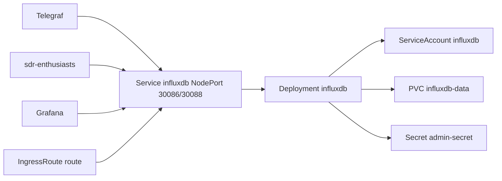

# influxdb を公式イメージへ移行する Implementation Plan

> **For agentic workers:** REQUIRED SUB-SKILL: Use superpowers:subagent-driven-development (recommended) or superpowers:executing-plans to implement this plan task-by-task. Steps use checkbox (`- [ ]`) syntax for tracking.

**Goal:** InfluxDB を Bitnami チャート (`influxdb` 6.6.16) + `bitnamilegacy/influxdb:2.7.11` から、公式 `influxdb:2.7.11` イメージの自前 Deployment に置き換える。

**Architecture:** 既存の PVC `influxdb-data` を UID 1001 のまま使い、Bitnami が環境変数で指定していたデータの場所 (`INFLUXD_BOLT_PATH` / `INFLUXD_ENGINE_PATH`) を同じ値で渡す。Deployment の名前・selector と Service (NodePort 30086 / 30088) を維持する。**ServiceAccount `influxdb` は同名で残す** (n8n で、非推奨の `serviceAccount` フィールドが残って Pod を作れなくなったため)。

**Tech Stack:** Kubernetes (kustomize), Argo CD, `public.ecr.aws/docker/library/influxdb:2.7.11`

**Spec:** `docs/superpowers/specs/2026-09-23_bitnami-migration.md`

## Global Constraints

- PUBLIC リポジトリ。コミット・PR に非公開リポジトリの詳細を書かない
- コミットは Conventional Commits、日本語。`Co-Authored-By: Claude Mythos 5.1 <noreply@anthropic.com>`
- InfluxDB のバージョンは 2.7.11 から動かさない
- イメージは `public.ecr.aws/docker/library/influxdb:2.7.11@sha256:d92a10e9e75aff18eca38ff3a8f0b4a800706a5dd44d1b0ece264af04458525b` (Debian 12 bookworm)
- Deployment `influxdb` の selector (`app.kubernetes.io/{component,instance,name}: influxdb`)、Service `influxdb` の型・ポート・nodePort、ServiceAccount `influxdb` を維持する
- 検証: `kubectl kustomize --enable-helm k8s/apps/influxdb` / `pnpm eslint k8s/apps/influxdb` / kube-linter はレンダリング結果に対して実行し、ベースラインとの差分で判断する

## 調査済みの事実

| 項目 | 値 |
| --- | --- |
| influxd の起動 | 引数なし。設定はすべて環境変数 |
| Bitnami が渡していた環境変数 | `INFLUXD_HTTP_BIND_ADDRESS=0.0.0.0:8086`, `INFLUXD_BOLT_PATH=/bitnami/influxdb/influxd.bolt`, `INFLUXD_ENGINE_PATH=/bitnami/influxdb`, `INFLUXD_CONFIG_PATH=/opt/bitnami/influxdb/etc` (空の emptyDir), `HOME=/bitnami/influxdb/`, `INFLUX_CONFIGS_PATH=/bitnami/influxdb/configs` |
| PVC の中身 | `influxd.bolt`, `influxd.sqlite` (bolt と同じディレクトリが既定), `data/` 3.5G, `wal/`, `replicationq/`, `configs` (CLI 設定。トークンを含むので読まない) |
| 所有者 | データは 1001:1001。PV ルート `/bitnami/influxdb` は別 UID 所有 + setgid 1001 |
| 公式イメージの entrypoint | bolt が存在すれば setup をスキップして `exec influxd`。非 root なら gosu しない。`chmod 700` を bolt のディレクトリに試みるが、所有者でなければ失敗して無視される (`|| :`)。`/etc/influxdb2` を `mkdir`/`chmod` する (失敗は無視) |
| 起動時間 | 直近の起動で `Open store (end)` まで 10.2 秒、Listening まで 12 秒 |
| クライアント | Telegraf (`http://influxdb.influxdb:8086`)、sdr-enthusiasts (同)、Grafana、NodePort 30086 経由の外部 |

## ファイル構成

| ファイル | 操作 | 責務 |
| --- | --- | --- |
| `k8s/apps/influxdb/resources/deployment.yaml` | 新規 | InfluxDB 本体 |
| `k8s/apps/influxdb/resources/service.yaml` | 新規 | NodePort Service |
| `k8s/apps/influxdb/resources/serviceaccount.yaml` | 新規 | チャートから引き継ぐ ServiceAccount |
| `k8s/apps/influxdb/kustomization.yaml` | 変更 | helmCharts と images を削除し、resources に追加 |

チャートが作っていた NetworkPolicy (8086 / 8088 の ingress と egress をすべて許可) と PodDisruptionBudget (replicas 1 に `maxUnavailable: 1`) は移さない。n8n と同じ判断 (実質的に効いていない)。

---

### Task 1: マニフェストを書く

**Files:**
- Create: `k8s/apps/influxdb/resources/deployment.yaml`
- Create: `k8s/apps/influxdb/resources/service.yaml`
- Create: `k8s/apps/influxdb/resources/serviceaccount.yaml`
- Modify: `k8s/apps/influxdb/kustomization.yaml`

**Interfaces:**
- Produces: Task 2 はこの Deployment の env / volumeMounts / securityContext を docker の引数に写して使う

- [ ] **Step 1: 変更前のレンダリング結果と kube-linter のベースラインを保存する**

```bash
S=$(mktemp -d)   # 以降のタスクでも同じディレクトリを使う
kubectl kustomize --enable-helm k8s/apps/influxdb > $S/influx-before.yaml
kube-linter lint --config .kube-linter.yaml $S/influx-before.yaml 2>&1 | grep -oE '\(object: [^ ]+ [^)]*\).*\(check: [a-z-]+' | sed -E 's/\(object: ([^ ]+) [^,]*, Kind=([A-Za-z]+)\).*\(check: ([a-z-]+)/\2 \1 \3/' | sort > $S/kl-influx-before.txt
```

- [ ] **Step 2: ServiceAccount を書く**

`k8s/apps/influxdb/resources/serviceaccount.yaml`:

```yaml
apiVersion: v1
kind: ServiceAccount
metadata:
  name: influxdb

# Bitnami チャートが作っていた ServiceAccount を引き継ぐ。
# 稼働中の Deployment には非推奨フィールドの spec.template.spec.serviceAccount が残っており、
# マニフェストから serviceAccountName を外しても 3-way merge では消えず、この名前を参照し続ける。
automountServiceAccountToken: false
```

- [ ] **Step 3: Service を書く**

`k8s/apps/influxdb/resources/service.yaml`:

```yaml
apiVersion: v1
kind: Service
metadata:
  name: influxdb

spec:
  type: NodePort
  selector:
    app.kubernetes.io/component: influxdb
    app.kubernetes.io/instance: influxdb
    app.kubernetes.io/name: influxdb
  ports:
    - name: http
      port: 8086
      targetPort: http
      nodePort: 30086
    - name: rpc
      port: 8088
      targetPort: rpc
      nodePort: 30088
```

- [ ] **Step 4: Deployment を書く**

`k8s/apps/influxdb/resources/deployment.yaml`:

```yaml
apiVersion: apps/v1
kind: Deployment
metadata:
  name: influxdb

spec:
  replicas: 1
  # selector は不変なので、Bitnami チャートが作っていた値を維持してその場で更新させる
  selector:
    matchLabels:
      app.kubernetes.io/component: influxdb
      app.kubernetes.io/instance: influxdb
      app.kubernetes.io/name: influxdb
  strategy:
    type: Recreate # host volume を使っているので RollingUpdate できない
  template:
    metadata:
      labels:
        app.kubernetes.io/component: influxdb
        app.kubernetes.io/instance: influxdb
        app.kubernetes.io/name: influxdb
    spec:
      automountServiceAccountToken: false
      serviceAccountName: influxdb
      containers:
        - name: influxdb
          image: public.ecr.aws/docker/library/influxdb:2.7.11@sha256:d92a10e9e75aff18eca38ff3a8f0b4a800706a5dd44d1b0ece264af04458525b
          env:
            # Bitnami のイメージが使っていたデータの場所をそのまま使う
            - name: INFLUXD_BOLT_PATH
              value: /bitnami/influxdb/influxd.bolt
            - name: INFLUXD_ENGINE_PATH
              value: /bitnami/influxdb
            - name: INFLUXD_HTTP_BIND_ADDRESS
              value: 0.0.0.0:8086
            # 設定ファイルは置かない。entrypoint が書き込もうとするので emptyDir にしてある
            - name: INFLUXD_CONFIG_PATH
              value: /etc/influxdb2
            - name: HOME
              value: /bitnami/influxdb
            # influx CLI の接続設定。Bitnami の初期化時に作られたものを使い続ける
            - name: INFLUX_CONFIGS_PATH
              value: /bitnami/influxdb/configs
            # 運用で influx CLI を使うときに参照する。サーバー自体は使わない
            - name: INFLUXDB_ADMIN_ORG
              value: primary
            - name: INFLUXDB_ADMIN_USER_TOKEN_FILE
              value: /run/secrets/influxdb/admin-user-token
          ports:
            - name: http
              containerPort: 8086
            - name: rpc
              containerPort: 8088
          # 起動時は shard の open と WAL の再生を待つ。データ量が多かった頃は最大 340 秒かかった。
          # 起動完了までは HTTP listener が上がらないので /health への接続自体が失敗する。
          startupProbe:
            failureThreshold: 20
            httpGet:
              path: /health
              port: http
            initialDelaySeconds: 60
            periodSeconds: 30
            timeoutSeconds: 30
          livenessProbe:
            failureThreshold: 6
            httpGet:
              path: /
              port: http
            periodSeconds: 45
            timeoutSeconds: 30
          readinessProbe:
            failureThreshold: 6
            httpGet:
              path: /health
              port: http
            periodSeconds: 45
            timeoutSeconds: 30
          # 12 GB / 322 shard の頃、memory limit 1536Mi ではページキャッシュが確保できず
          # reclaim を繰り返して liveness probe が timeout していた。データ量に見合う limit を明示する。
          resources:
            limits:
              cpu: "2"
              ephemeral-storage: 2Gi
              memory: 4Gi
            requests:
              cpu: 500m
              ephemeral-storage: 50Mi
              memory: 2Gi
          securityContext:
            allowPrivilegeEscalation: false
            capabilities:
              drop:
                - ALL
            readOnlyRootFilesystem: true
            # 既存データの所有者が 1001 なので合わせる
            runAsGroup: 1001
            runAsNonRoot: true
            runAsUser: 1001
          volumeMounts:
            - name: data
              mountPath: /bitnami/influxdb
            - name: config
              mountPath: /etc/influxdb2
            - name: tmp
              mountPath: /tmp
            - name: admin-secret
              mountPath: /run/secrets/influxdb
              readOnly: true
      securityContext:
        fsGroup: 1001
        fsGroupChangePolicy: OnRootMismatch
        seccompProfile:
          type: RuntimeDefault
      volumes:
        - name: data
          persistentVolumeClaim:
            claimName: influxdb-data
        - name: config
          emptyDir: {}
        - name: tmp
          emptyDir: {}
        - name: admin-secret
          secret:
            secretName: admin-secret
```

旧チャートの `startupProbe` に付いていたコメント (チャート既定のコマンドが壊れていた件) は、チャートを使わなくなるので消す。起動時間の説明だけを残す。

- [ ] **Step 5: kustomization.yaml を直す**

`k8s/apps/influxdb/kustomization.yaml` から `images:` ブロック全体 (コメントを含む) と `helmCharts:` ブロック全体を削除する。ただし `helmCharts` 内にある **bucket のリテンション変更手順のコメント** は、`resources:` の直前に次の形で残す (トークンの参照先が変わる)。

```yaml
# telegraf バケットのリテンションは 90 日、shard group duration は 7d (2026-08-29 に変更)。
# バケットは Helm でも Terraform でも管理していない (TFC からクラスタ内へ到達できない) ため、
# influx CLI で直接適用している。値を変えるときは下記を実行する。
#
#   kubectl -n influxdb exec deploy/influxdb -- bash -c \
#     'export INFLUX_TOKEN=$(cat "$INFLUXDB_ADMIN_USER_TOKEN_FILE"); \
#      influx bucket update --host http://127.0.0.1:8086 -i 9640aa1885903715 \
#        --retention 90d --shard-group-duration 168h'
resources:
  - ./resources/authentik.yaml
  - ./resources/deployment.yaml
  - ./resources/dns.yaml
  - ./resources/ingress.yaml
  - ./resources/secret.yaml
  - ./resources/service.yaml
  - ./resources/serviceaccount.yaml
  - ./resources/volume.yaml
```

- [ ] **Step 6: レンダリングして差分を確かめる**

```bash
kubectl kustomize --enable-helm k8s/apps/influxdb > $S/influx-after.yaml
grep -n bitnami $S/influx-after.yaml
diff <(grep -E '^kind:|^  name:' $S/influx-before.yaml | paste - - | sort) <(grep -E '^kind:|^  name:' $S/influx-after.yaml | paste - - | sort)
```

Expected: `grep bitnami` は env の値と mountPath の `/bitnami/influxdb...` だけで、image 行は無い。diff は `NetworkPolicy/influxdb` と `PodDisruptionBudget/influxdb` が消えるだけ (ServiceAccount / Service / Deployment は残る)。

- [ ] **Step 7: lint を通す**

```bash
pnpm eslint k8s/apps/influxdb
kube-linter lint --config .kube-linter.yaml $S/influx-after.yaml 2>&1 | grep -oE '\(object: [^ ]+ [^)]*\).*\(check: [a-z-]+' | sed -E 's/\(object: ([^ ]+) [^,]*, Kind=([A-Za-z]+)\).*\(check: ([a-z-]+)/\2 \1 \3/' | sort > $S/kl-influx-after.txt
diff $S/kl-influx-before.txt $S/kl-influx-after.txt
```

Expected: eslint のエラーは 0 件。並び順の指摘は `pnpm eslint --fix k8s/apps/influxdb` で直す。`--fix` の後、コメントが対応するキーの直上にあることを確かめる。

kube-linter の差分で許容するのは次だけ。それ以外が出たら、抑制せずにユーザーに相談する。
- PDB の指摘が消える
- `Deployment influxdb non-isolated-pod` が増える (ユーザー承認済み)

- [ ] **Step 8: server-side dry-run と、Pod テンプレートの SA 参照を確かめる**

```bash
kubectl apply --server-side --dry-run=server --force-conflicts -f $S/influx-after.yaml 2>&1 | grep -v 'last-applied-configuration' | grep -iE 'error|invalid|forbidden|deployment|serviceaccount'
kubectl -n influxdb get deploy influxdb -o jsonpath='{.spec.template.spec.serviceAccount}|{.spec.template.spec.serviceAccountName}{"\n"}'
kubectl -n influxdb get sa influxdb
```

Expected: エラーは無く、`deployment.apps/influxdb` と `serviceaccount/influxdb` が受理される。稼働中の SA 参照は `influxdb|influxdb` で、同名の SA がマニフェストに残っていることで参照が切れない。

不変フィールドのエラーが出たら、ここで止まってユーザーに相談する。稼働中のリソースは消さない。

- [ ] **Step 9: コミット**

```bash
git add k8s/apps/influxdb
git commit -F - <<'EOF'
feat(influxdb): Bitnami チャートから公式イメージに移行する

Co-Authored-By: Claude Mythos 5.1 <noreply@anthropic.com>
EOF
```

---

### Task 2: 手元で同一構成の起動を確かめる

本番の PVC やトークンには触れない。Bitnami のイメージで初期化したデータディレクトリを、公式イメージで Task 1 と同じ UID・環境変数・マウントで起動する。

本番データは使わない。バージョンが同じなのでオンディスク形式の互換性は問題にならず、確かめたいのはパスと権限の構成である。また bolt には API トークンが平文で入っているので、手元に持ち出さない。

**Files:** なし (scratchpad のみ)

- [ ] **Step 1: Bitnami のイメージで初期化し、データを書く**

```bash
docker volume create influx-test
docker run -d --name influx-bitnami -v influx-test:/bitnami/influxdb \
  -e INFLUXDB_ADMIN_USER=admin -e INFLUXDB_ADMIN_USER_PASSWORD=testtest123 \
  -e INFLUXDB_ADMIN_USER_TOKEN=testtoken -e INFLUXDB_ADMIN_ORG=primary -e INFLUXDB_ADMIN_BUCKET=primary \
  -e INFLUXDB_HTTP_AUTH_ENABLED=true \
  docker.io/bitnamilegacy/influxdb:2.7.11-debian-12-r20@sha256:587eaebfa5245ab7b46ce2f775f110cfcff028d816bae14d9ce987b21255798f
until docker exec influx-bitnami curl -sf http://127.0.0.1:8086/health >/dev/null; do sleep 2; done
docker exec influx-bitnami influx write --host http://127.0.0.1:8086 -t testtoken -o primary -b primary 'm,host=a v=42i 1758585600000000000'
docker exec influx-bitnami ls -la /bitnami/influxdb
docker stop influx-bitnami
```

Expected: `influxd.bolt`, `influxd.sqlite`, `data`, `wal`, `configs` が 1001 所有で存在する。

- [ ] **Step 2: 公式イメージで同じボリュームを起動する**

```bash
docker run -d --name influx-official --user 1001:1001 --read-only \
  --tmpfs /etc/influxdb2 --tmpfs /tmp \
  -v influx-test:/bitnami/influxdb \
  -e INFLUXD_BOLT_PATH=/bitnami/influxdb/influxd.bolt -e INFLUXD_ENGINE_PATH=/bitnami/influxdb \
  -e INFLUXD_HTTP_BIND_ADDRESS=0.0.0.0:8086 -e INFLUXD_CONFIG_PATH=/etc/influxdb2 \
  -e HOME=/bitnami/influxdb -e INFLUX_CONFIGS_PATH=/bitnami/influxdb/configs \
  public.ecr.aws/docker/library/influxdb:2.7.11@sha256:d92a10e9e75aff18eca38ff3a8f0b4a800706a5dd44d1b0ece264af04458525b
until docker exec influx-official curl -sf http://127.0.0.1:8086/health; do sleep 2; done; echo
docker logs influx-official 2>&1 | grep -E 'found existing boltdb|Listening|lvl=error' | head
```

Expected: `found existing boltdb file, skipping setup wrapper` と `Listening` が出て、`lvl=error` は出ない。`/health` が `"status":"pass"` を返す。

- [ ] **Step 3: 既存のトークンで読み書きできることを確かめる**

```bash
docker exec influx-official influx query --host http://127.0.0.1:8086 -t testtoken -o primary --raw \
  'from(bucket:"primary") |> range(start: 2025-09-01T00:00:00Z) |> filter(fn: (r) => r._measurement == "m")' | grep -v '^#' | grep ',v,'
docker exec influx-official influx write --host http://127.0.0.1:8086 -t testtoken -o primary -b primary 'm,host=b v=43i'
docker exec influx-official influx bucket list --host http://127.0.0.1:8086 -t testtoken -o primary
```

Expected: 値 `42` の行が返り、書き込みがエラー無く通り、`primary` バケットが一覧に出る。

- [ ] **Step 4: 停止を確かめる**

```bash
time docker stop -t 30 influx-official
docker logs influx-official 2>&1 | grep -iE 'Terminating|Stopping|shutdown' | head -5
```

Expected: 30 秒を待たずに終わる (SIGTERM で正常終了する)。

- [ ] **Step 5: 後片付け**

```bash
docker rm influx-bitnami influx-official; docker volume rm influx-test
```

---

### Task 3: PR を出す

- [ ] **Step 1: push して PR を作る**

PR 本文 (日本語) に含めるもの:
- `Part of #6027`
- 方式: 既存 PVC と同一バージョン、環境変数によるパスの引き継ぎ、ServiceAccount を残す理由 (#10550 の障害)
- 消えるリソース: NetworkPolicy / PDB とその理由
- before / after: Task 1 Step 6・8 と Task 2 の出力
- リソースグラフ (Mermaid):



- 末尾に `🤖 Generated with [Claude Code](https://claude.com/claude-code)`

```bash
git push -u origin feat/bitnami-migration-influxdb
gh pr create --title "feat(influxdb): Bitnami チャートから公式イメージに移行する" --body-file $S/pr-body.md --assignee SlashNephy
```

- [ ] **Step 2: CI と CodeRabbit / Qodo の指摘に対応する**

---

### Task 4: マージ後の検証

マージはユーザーの操作。Recreate なので、切り替え中は数十秒 InfluxDB が止まる。Telegraf は送れなかった分をバッファして、後で再送する。

- [ ] **Step 1: 同期されたリビジョンと Pod を確かめる**

```bash
kubectl -n argo-cd get application influxdb -o jsonpath='{.status.sync.revision} {.status.sync.status} {.status.health.status}{"\n"}'
git rev-parse origin/master
kubectl -n influxdb get pods -o 'custom-columns=N:.metadata.name,S:.status.phase,R:.status.containerStatuses[0].restartCount,I:.spec.containers[0].image'
kubectl -n influxdb get events --sort-by=.lastTimestamp | tail -10
```

Expected: リビジョンが一致し、公式イメージの Pod が Running、再起動 0 回。`FailedCreate` が無い。

Pod ができない場合は、`kubectl -n influxdb describe rs` で理由を確かめてから、すぐにユーザーに報告する。

- [ ] **Step 2: ログを確かめる**

```bash
kubectl -n influxdb logs deploy/influxdb | grep -E 'found existing boltdb|Open store \(end\)|Listening|lvl=error' | head
```

Expected: `found existing boltdb file` と `Listening` が出て、`lvl=error` は出ない。

- [ ] **Step 3: 書き込みが続いていることを確かめる**

```bash
kubectl -n influxdb exec deploy/influxdb -- sh -c \
  'influx query --raw --host http://localhost:8086 --token "$(cat $INFLUXDB_ADMIN_USER_TOKEN_FILE)" --org "$INFLUXDB_ADMIN_ORG" \
   "from(bucket:\"telegraf\") |> range(start: -5m) |> filter(fn: (r) => r._measurement == \"cpu\") |> last() |> keep(columns: [\"_time\"]) |> limit(n:1)"' \
  | grep -v '^#' | grep -v '^,result' | head -3
kubectl -n telegraf logs deploy/deployment --since=10m 2>&1 | grep -iE 'error|influx' | tail -5
```

Expected: 直近 1 分以内の `_time` が返る。Telegraf のログに、切り替え中の一時的なエラーはあってもよいが、切り替えの後にエラーが続いていない。

Telegraf の namespace や workload 名が違ったら、`kubectl get pods -A | grep telegraf` で探す。

- [ ] **Step 4: NodePort からの疎通を確かめる**

```bash
curl -s -o /dev/null -w '%{http_code}\n' http://lily:30086/health
```

Expected: `200`。

- [ ] **Step 5: PR に after の証跡をコメントする**

## 切り戻し

PR を revert してマージする。データの形式は変わっていないので、Bitnami のイメージでそのまま読める。ServiceAccount は同名で残っているので、revert しても参照は切れない。
