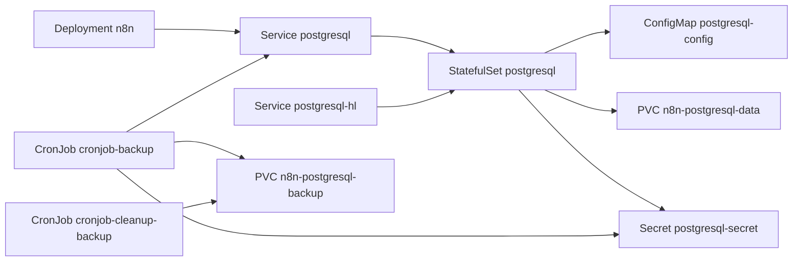

# n8n の PostgreSQL を公式イメージへ移行する Implementation Plan

> **For agentic workers:** REQUIRED SUB-SKILL: Use superpowers:subagent-driven-development (recommended) or superpowers:executing-plans to implement this plan task-by-task. Steps use checkbox (`- [ ]`) syntax for tracking.

**Goal:** n8n の PostgreSQL を Bitnami チャート + `bitnamilegacy/postgresql` から、公式 `postgres` イメージの自前 StatefulSet に置き換える。

**Architecture:** 既存の PVC `n8n-postgresql-data` を UID 1001 のまま使い、`PGDATA=/bitnami/postgresql/data` を維持する。Bitnami はデータディレクトリの外 (emptyDir) に設定を生成していたので、同等の `postgresql.conf` / `pg_hba.conf` を ConfigMap で渡す。StatefulSet の名前・selector・serviceName と Service 名を維持し、Argo CD の同期で Pod が入れ替わるだけにする。

**Tech Stack:** Kubernetes (kustomize), Argo CD, `public.ecr.aws/docker/library/postgres:17.6-bookworm`

**Spec:** `docs/superpowers/specs/2026-09-23_bitnami-migration.md`

## Global Constraints

- PUBLIC リポジトリ。コミット・PR に非公開リポジトリの詳細を書かない
- コミットは Conventional Commits、日本語。`Co-Authored-By: Claude Mythos 5.1 <noreply@anthropic.com>`
- PostgreSQL のバージョンは 17.6 から動かさない
- イメージは **bookworm** 版を使う。既存 DB の照合順序は libc `en_US.UTF-8` で `datcollversion = 2.36` が記録されており、glibc 2.36 の bookworm なら一致する (trixie は 2.41 で不一致警告と索引破損のリスクがある)
- イメージは `public.ecr.aws/docker/library/*` に digest 付きで書く (リポジトリの慣習)
- 検証コマンド: `kubectl kustomize --enable-helm k8s/apps/n8n` / `pnpm eslint` / `kube-linter lint --config .kube-linter.yaml k8s/apps/n8n`

## 調査済みの事実

| 項目 | 値 |
| --- | --- |
| データディレクトリ | `/bitnami/postgresql/data` (所有 1001:1001, 0700 + setgid) |
| データディレクトリ内の設定 | `postgresql.conf` / `pg_hba.conf` は**無い**。`pg_ident.conf` と `postgresql.auto.conf` (空) のみ |
| Bitnami 生成の非既定設定 | `listen_addresses='*'`, `max_wal_size='400MB'`, `client_min_messages='error'`, `shared_preload_libraries='pgaudit'` ほか複製用 |
| pg_hba | `local`/`host` 全て `md5` (IPv4/IPv6 の全アドレス) |
| 拡張 | `plpgsql` のみ (pgaudit は preload されているだけで未作成) |
| 公式イメージ | `STOPSIGNAL SIGINT`, glibc 2.36, `en_US.utf8` あり, digest `sha256:f3bd19c606e442c3d7bdfa8002e03fe260a1023351e0ea4598032022b68dd6e3` |

pgaudit は公式イメージに無いので preload を外す。拡張を作っていないので影響は無い。複製用の設定 (`wal_keep_size` 等) は単一インスタンスで不要なので移さない。

## ファイル構成

| ファイル | 操作 | 責務 |
| --- | --- | --- |
| `k8s/apps/n8n/resources/configmap-postgresql.yaml` | 新規 | `postgresql.conf` / `pg_hba.conf` |
| `k8s/apps/n8n/resources/statefulset-postgresql.yaml` | 新規 | PostgreSQL 本体 |
| `k8s/apps/n8n/resources/service-postgresql.yaml` | 新規 | `postgresql` / `postgresql-hl` |
| `k8s/apps/n8n/resources/cronjob-backup.yaml` | 新規 | 毎時の `pg_dumpall` |
| `k8s/apps/n8n/kustomization.yaml` | 変更 | `postgresql` の helmCharts と bitnami の images を削除、resources に追加 |

チャートが作っていた ServiceAccount / NetworkPolicy / PodDisruptionBudget は移さない。NetworkPolicy は ingress 5432 を全許可・egress 全許可で実質無制限、PDB は replicas 1 に対し `maxUnavailable: 1` で無効だったため。Argo CD の prune で消える。

---

### Task 1: マニフェストを書く

**Files:**
- Create: `k8s/apps/n8n/resources/configmap-postgresql.yaml`
- Create: `k8s/apps/n8n/resources/statefulset-postgresql.yaml`
- Create: `k8s/apps/n8n/resources/service-postgresql.yaml`
- Create: `k8s/apps/n8n/resources/cronjob-backup.yaml`
- Modify: `k8s/apps/n8n/kustomization.yaml`

**Interfaces:**
- Produces: ConfigMap `postgresql-config` (keys `postgresql.conf`, `pg_hba.conf`)。Task 2 はこの 2 ファイルを `kubectl kustomize` の出力から取り出して使う

- [ ] **Step 1: 変更前のレンダリング結果を保存する**

```bash
S=/tmp/claude-1000/-home-spica-ghq-github-com-SlashNephy-infrastructure/d1c3a786-dc9f-4ece-b0ff-f01322095888/scratchpad
kubectl kustomize --enable-helm k8s/apps/n8n > $S/n8n-before.yaml
```

- [ ] **Step 2: ConfigMap を書く**

`k8s/apps/n8n/resources/configmap-postgresql.yaml`:

```yaml
apiVersion: v1
kind: ConfigMap
metadata:
  name: postgresql-config

# Bitnami のイメージは設定をデータディレクトリの外に生成しており、PVC 側には postgresql.conf も pg_hba.conf も無い。
# 公式イメージでも同じ PVC を使うため、Bitnami が生成していた値のうち単一インスタンスで意味のあるものを渡す。
data:
  postgresql.conf: |
    listen_addresses = '*'
    port = 5432
    max_wal_size = 400MB
    client_min_messages = error
  pg_hba.conf: |
    local all all md5
    host all all 127.0.0.1/32 md5
    host all all ::1/128 md5
    host all all 0.0.0.0/0 md5
    host all all ::/0 md5
```

- [ ] **Step 3: Service を書く**

`k8s/apps/n8n/resources/service-postgresql.yaml`:

```yaml
apiVersion: v1
kind: Service
metadata:
  name: postgresql

spec:
  selector:
    app.kubernetes.io/component: primary
    app.kubernetes.io/instance: postgresql
    app.kubernetes.io/name: postgresql
  ports:
    - name: tcp-postgresql
      port: 5432
      targetPort: tcp-postgresql

---
# StatefulSet の serviceName は不変なので、チャートが作っていた headless Service の名前を維持する
apiVersion: v1
kind: Service
metadata:
  name: postgresql-hl

spec:
  clusterIP: None
  publishNotReadyAddresses: true
  selector:
    app.kubernetes.io/component: primary
    app.kubernetes.io/instance: postgresql
    app.kubernetes.io/name: postgresql
  ports:
    - name: tcp-postgresql
      port: 5432
      targetPort: tcp-postgresql
```

- [ ] **Step 4: StatefulSet を書く**

`k8s/apps/n8n/resources/statefulset-postgresql.yaml`:

```yaml
apiVersion: apps/v1
kind: StatefulSet
metadata:
  name: postgresql

spec:
  replicas: 1
  # selector と serviceName は不変なので、Bitnami チャートが作っていた値を維持してその場で更新させる
  selector:
    matchLabels:
      app.kubernetes.io/component: primary
      app.kubernetes.io/instance: postgresql
      app.kubernetes.io/name: postgresql
  serviceName: postgresql-hl
  template:
    metadata:
      labels:
        app.kubernetes.io/component: primary
        app.kubernetes.io/instance: postgresql
        app.kubernetes.io/name: postgresql
    spec:
      automountServiceAccountToken: false
      containers:
        - name: postgresql
          # bookworm (glibc 2.36) に固定する。既存 DB は libc の en_US.UTF-8 照合で collation version 2.36 が
          # 記録されており、glibc が変わると索引の並び順が食い違う恐れがある。
          image: public.ecr.aws/docker/library/postgres:17.6-bookworm@sha256:f3bd19c606e442c3d7bdfa8002e03fe260a1023351e0ea4598032022b68dd6e3
          args:
            - -c
            - config_file=/etc/postgresql/postgresql.conf
            - -c
            - hba_file=/etc/postgresql/pg_hba.conf
          env:
            # Bitnami のイメージが使っていたデータディレクトリをそのまま使う
            - name: PGDATA
              value: /bitnami/postgresql/data
            - name: TZ
              value: Asia/Tokyo
          ports:
            - name: tcp-postgresql
              containerPort: 5432
          livenessProbe:
            exec:
              command: [pg_isready, -U, n8n, -d, dbname=n8n, -h, 127.0.0.1, -p, "5432"]
            failureThreshold: 6
            initialDelaySeconds: 30
            periodSeconds: 10
            timeoutSeconds: 5
          readinessProbe:
            exec:
              command: [pg_isready, -U, n8n, -d, dbname=n8n, -h, 127.0.0.1, -p, "5432"]
            failureThreshold: 6
            initialDelaySeconds: 5
            periodSeconds: 10
            timeoutSeconds: 5
          resources:
            limits:
              cpu: 150m
              ephemeral-storage: 2Gi
              memory: 192Mi
            requests:
              cpu: 100m
              ephemeral-storage: 50Mi
              memory: 128Mi
          securityContext:
            allowPrivilegeEscalation: false
            capabilities:
              drop:
                - ALL
            readOnlyRootFilesystem: true
            # 既存データの所有者が 1001 なので合わせる
            runAsGroup: 1001
            runAsNonRoot: true
            runAsUser: 1001
          volumeMounts:
            - name: data
              mountPath: /bitnami/postgresql
            - name: config
              mountPath: /etc/postgresql
              readOnly: true
            - name: run
              mountPath: /var/run/postgresql
            - name: tmp
              mountPath: /tmp
            - name: dshm
              mountPath: /dev/shm
      securityContext:
        fsGroup: 1001
        fsGroupChangePolicy: OnRootMismatch
        seccompProfile:
          type: RuntimeDefault
      volumes:
        - name: data
          persistentVolumeClaim:
            claimName: n8n-postgresql-data
        - name: config
          configMap:
            name: postgresql-config
        - name: run
          emptyDir: {}
        - name: tmp
          emptyDir: {}
        - name: dshm
          emptyDir:
            medium: Memory
```

停止シグナルについて: 公式イメージは `STOPSIGNAL SIGINT` (fast shutdown) を持つため、Bitnami 用に入れていた preStop の `pg_ctl stop -m fast` は移さない。

- [ ] **Step 5: バックアップ CronJob を書く**

`k8s/apps/n8n/resources/cronjob-backup.yaml`:

```yaml
apiVersion: batch/v1
kind: CronJob
metadata:
  name: cronjob-backup

# ファイル名の形式は cronjob-cleanup-backup の glob (pg_dumpall-*.pgdump) と揃えている
spec:
  schedule: "20 * * * *"
  timeZone: Asia/Tokyo
  jobTemplate:
    spec:
      backoffLimit: 0
      template:
        spec:
          containers:
            - name: app
              image: public.ecr.aws/docker/library/postgres:17.6-bookworm@sha256:f3bd19c606e442c3d7bdfa8002e03fe260a1023351e0ea4598032022b68dd6e3
              command:
                - bash
                - -c
                - pg_dumpall --clean --if-exists --load-via-partition-root --quote-all-identifiers --no-password --file="/backup/pg_dumpall-$(date '+%Y-%m-%d-%H-%M').pgdump"
              env:
                - name: PGHOST
                  value: postgresql
                - name: PGUSER
                  value: postgres
                - name: PGPASSWORD
                  valueFrom:
                    secretKeyRef:
                      name: postgresql-secret
                      key: postgres-password
                - name: TZ
                  value: Asia/Tokyo
              volumeMounts:
                - name: backup
                  mountPath: /backup
              securityContext:
                allowPrivilegeEscalation: false
                capabilities:
                  drop:
                    - ALL
                readOnlyRootFilesystem: true
                runAsGroup: 1001
                runAsNonRoot: true
                runAsUser: 1001
          volumes:
            - name: backup
              persistentVolumeClaim:
                claimName: n8n-postgresql-backup
          restartPolicy: Never
          securityContext:
            fsGroup: 1001
            seccompProfile:
              type: RuntimeDefault
  concurrencyPolicy: Forbid
  successfulJobsHistoryLimit: 1
  failedJobsHistoryLimit: 1
```

- [ ] **Step 6: kustomization.yaml を直す**

`k8s/apps/n8n/kustomization.yaml` から次を削除する。

- `images:` の `docker.io/bitnami/postgresql` のエントリとその上のコメント 2 行
- `helmCharts:` の `- name: postgresql` のエントリ全体 (preStop のコメントを含む)

`resources:` を次にする (アルファベット順)。

```yaml
resources:
  - ./resources/configmap-postgresql.yaml
  - ./resources/cronjob-backup.yaml
  - ./resources/cronjob-cleanup-backup.yaml
  - ./resources/dns.yaml
  - ./resources/ingress.yaml
  - ./resources/secret.yaml
  - ./resources/service-lm-studio.yaml
  - ./resources/service-postgresql.yaml
  - ./resources/statefulset-postgresql.yaml
  - ./resources/volume-backup.yaml
  - ./resources/volume-data.yaml
  - ./resources/volume-postgresql.yaml
```

- [ ] **Step 7: レンダリングして差分を確かめる**

```bash
kubectl kustomize --enable-helm k8s/apps/n8n > $S/n8n-after.yaml
grep -c bitnami $S/n8n-after.yaml
diff <(grep -E '^kind:|^  name:' $S/n8n-before.yaml | paste - - | sort) <(grep -E '^kind:|^  name:' $S/n8n-after.yaml | paste - - | sort)
```

Expected: `grep -c bitnami` が `2` (PGDATA の値とマウント先の `/bitnami/postgresql` のみ。`grep bitnami` で image 行が無いことを目視)。diff は `ServiceAccount/postgresql`, `NetworkPolicy/postgresql`, `NetworkPolicy/postgresql-pgdumpall`, `PodDisruptionBudget/postgresql`, `CronJob/postgresql-pgdumpall` が消え、`ConfigMap/postgresql-config`, `CronJob/cronjob-backup` が増えるだけ。

- [ ] **Step 8: lint を通す**

```bash
pnpm eslint k8s/apps/n8n
kube-linter lint --config .kube-linter.yaml k8s/apps/n8n
```

Expected: どちらもエラー 0。kube-linter の指摘が出た場合は抑制せずユーザーに相談する。

- [ ] **Step 9: server-side dry-run で受理を確かめる**

```bash
kubectl apply --server-side --dry-run=server -f $S/n8n-after.yaml --force-conflicts 2>&1 | grep -v 'serverside-applied\|unchanged'
```

Expected: 出力なし (StatefulSet の不変フィールド変更エラーが出ないこと)。

- [ ] **Step 10: コミット**

```bash
git add k8s/apps/n8n
git commit -F - <<'EOF'
feat(n8n): PostgreSQL を Bitnami チャートから公式イメージに移行する

Co-Authored-By: Claude Mythos 5.1 <noreply@anthropic.com>
EOF
```

---

### Task 2: 手元で同一構成の起動を確かめる

本番の PVC には触れない。Bitnami のイメージで作った同一バージョンのデータディレクトリに本番のダンプを流し込み、それを公式イメージで Task 1 と同じ UID・パス・引数で起動する。

**Files:** なし (scratchpad のみ)

**Interfaces:**
- Consumes: Task 1 の `$S/n8n-after.yaml` に含まれる ConfigMap `postgresql-config`

- [ ] **Step 1: ConfigMap の中身を取り出す**

```bash
mkdir -p $S/pgconf
python3 - <<EOF
import yaml
for d in yaml.safe_load_all(open("$S/n8n-after.yaml")):
    if d and d["kind"] == "ConfigMap" and d["metadata"]["name"] == "postgresql-config":
        for k, v in d["data"].items():
            open(f"$S/pgconf/{k}", "w").write(v)
EOF
ls $S/pgconf
```

Expected: `pg_hba.conf  postgresql.conf`

- [ ] **Step 2: 本番の最新ダンプを取得する**

バックアップ PVC の実体は lily の `/mnt/local/n8n/postgresql-backup`。

```bash
F=$(ssh lily 'ls -1 /mnt/local/n8n/postgresql-backup/pg_dumpall-*.pgdump | tail -1')
ssh lily "cat $F" > $S/n8n.pgdump
head -c 300 $S/n8n.pgdump; ls -la $S/n8n.pgdump
```

Expected: `--` で始まる SQL で、サイズが 0 でない。

- [ ] **Step 3: Bitnami のイメージでデータディレクトリを作り、ダンプを流し込む**

```bash
docker volume create n8n-pg-test
docker run -d --name pg-bitnami -v n8n-pg-test:/bitnami/postgresql \
  -e POSTGRESQL_POSTGRES_PASSWORD=test -e POSTGRESQL_USERNAME=n8n -e POSTGRESQL_PASSWORD=test -e POSTGRESQL_DATABASE=n8n \
  docker.io/bitnamilegacy/postgresql:17.6.0-debian-12-r4@sha256:926356130b77d5742d8ce605b258d35db9b62f2f8fd1601f9dbaef0c8a710a8d
until docker exec pg-bitnami pg_isready -h 127.0.0.1; do sleep 1; done
sed -E "s/ PASSWORD '[^']*'//" $S/n8n.pgdump \
  | docker exec -i -e PGPASSWORD=test pg-bitnami psql -h 127.0.0.1 -U postgres -d postgres -q 2>&1 \
  | grep -v 'already exists\|current user cannot be dropped' | tail -5
docker exec -e PGPASSWORD=test pg-bitnami psql -h 127.0.0.1 -U n8n -d n8n -Atc 'select count(*) from workflow_entity'
docker stop -t 30 pg-bitnami
```

ダンプに含まれるロールのパスワードハッシュは `sed` で落としている。本番のパスワードを手元に持ち込まず、テスト用の `test` のまま接続できるようにするため。

Expected: ワークフロー数が 1 以上で、`docker stop` が 30 秒待たずに終わる。

- [ ] **Step 4: 公式イメージで同じボリュームを起動する**

```bash
docker run -d --name pg-official --user 1001:1001 --read-only \
  --tmpfs /var/run/postgresql --tmpfs /tmp \
  -v n8n-pg-test:/bitnami/postgresql -v $S/pgconf:/etc/postgresql:ro \
  -e PGDATA=/bitnami/postgresql/data -e TZ=Asia/Tokyo \
  public.ecr.aws/docker/library/postgres:17.6-bookworm@sha256:f3bd19c606e442c3d7bdfa8002e03fe260a1023351e0ea4598032022b68dd6e3 \
  -c config_file=/etc/postgresql/postgresql.conf -c hba_file=/etc/postgresql/pg_hba.conf
sleep 5; docker logs pg-official 2>&1 | tail -10
```

Expected: `database system is ready to accept connections`。`not properly shut down` や `collation version mismatch` が出ない。

- [ ] **Step 5: TCP 経由でパスワード認証とクエリを確かめる**

```bash
docker run --rm --network container:pg-official -e PGPASSWORD=test \
  public.ecr.aws/docker/library/postgres:17.6-bookworm psql -h 127.0.0.1 -U n8n -d n8n -Atc \
  "select count(*) from workflow_entity; select datcollversion, pg_database_collation_actual_version(oid) from pg_database where datname='n8n'"
docker exec pg-official pg_isready -U n8n -d dbname=n8n -h 127.0.0.1 -p 5432
```

Expected: Step 3 と同じワークフロー数。collation version が `2.36|2.36`。`pg_isready` が `accepting connections`。

- [ ] **Step 6: 停止が fast shutdown になることを確かめる**

```bash
time docker stop -t 30 pg-official; docker logs pg-official 2>&1 | grep -i shutdown
```

Expected: 数秒で終わり、ログに `received fast shutdown request`。

- [ ] **Step 7: 後片付け**

本番データを含むため必ず消す。

```bash
docker rm pg-bitnami pg-official; docker volume rm n8n-pg-test; rm -f $S/n8n.pgdump
```

---

### Task 3: PR を出す

- [ ] **Step 1: push して Draft でない PR を作る**

PR 本文に含めるもの (日本語):
- 概要: #6027 の一環として n8n の PostgreSQL を公式イメージに移す。spec と plan へのリンク
- 方式: 既存 PVC をそのまま使い、同一バージョン (17.6) で載せ替える。bookworm を選んだ理由 (collation version)
- 消えるリソースとその理由 (ServiceAccount / NetworkPolicy ×2 / PDB / 旧 CronJob)
- before / after: Task 1 Step 7 の diff、Task 2 の Step 4〜6 の出力
- リソースグラフ (Mermaid):



- 末尾に `🤖 Generated with [Claude Code](https://claude.com/claude-code)`
- `Close #6027` は付けない (influxdb / epgstation が残るため)。`Part of #6027` とする

```bash
git push -u origin feat/bitnami-migration-n8n
gh pr create --title "feat(n8n): PostgreSQL を Bitnami チャートから公式イメージに移行する" --body-file $S/pr-body.md --assignee SlashNephy
gh pr view --json mergeable,mergeStateStatus
```

- [ ] **Step 2: CI と CodeRabbit / Qodo の指摘に対応する**

---

### Task 4: マージ後の検証

マージはユーザーが行う。マージ直前に最新のバックアップが 1 時間以内であることを確かめる。

```bash
ssh lily 'ls -la --time-style=+%F\ %T /mnt/local/n8n/postgresql-backup | tail -2'
```

- [ ] **Step 1: 同期されたリビジョンを確かめる**

Argo CD は webhook 駆動なので、Synced の表示ではなく revision を見る。

```bash
kubectl -n argocd get application n8n -o jsonpath='{.status.sync.revision}{"\n"}'; git rev-parse origin/master
```

一致しなければ Argo CD の UI から Refresh する。

- [ ] **Step 2: Pod を確かめる**

```bash
kubectl -n n8n get pods -o custom-columns=N:.metadata.name,S:.status.phase,R:.status.containerStatuses[0].restartCount,I:.spec.containers[0].image
kubectl -n n8n logs postgresql-0 | tail -20
```

Expected: `postgresql-0` が公式イメージで Running、restart 0。ログに `ready to accept connections`、`collation version mismatch` が無い。

- [ ] **Step 3: n8n からの利用を確かめる**

```bash
kubectl -n n8n logs deploy/n8n --since=10m | grep -iE 'error|database' | tail -20
kubectl -n n8n exec deploy/n8n -- wget -qO- http://127.0.0.1:5678/healthz/readiness
```

Expected: `{"status":"ok"}`。ブラウザで n8n にログインし、ワークフロー一覧が表示され、直近の実行履歴が切り替え後も増えていることを確かめる (スクリーンショットを PR に添付)。

- [ ] **Step 4: バックアップを確かめる**

```bash
kubectl -n n8n create job --from=cronjob/cronjob-backup backup-verify
kubectl -n n8n wait --for=condition=complete job/backup-verify --timeout=120s
ssh lily 'ls -la /mnt/local/n8n/postgresql-backup | tail -3'
kubectl -n n8n delete job backup-verify
```

Expected: 新しい `pg_dumpall-*.pgdump` が増え、サイズが直前のものと同程度。

- [ ] **Step 5: 停止が fast shutdown になることを確かめる**

```bash
kubectl -n n8n delete pod postgresql-0
kubectl -n n8n wait --for=condition=Ready pod/postgresql-0 --timeout=120s
kubectl -n n8n logs postgresql-0 | grep -iE 'not properly shut down|ready to accept'
```

Expected: 新しい Pod の起動ログに `not properly shut down` が無い。

- [ ] **Step 6: PR に after の証跡をコメントする**

## 切り戻し

PR を revert してマージする。データの形式は変わっていないので Bitnami のイメージがそのまま読める。PGDATA 内に公式イメージが書いた `postmaster.opts` は起動時に上書きされる。
